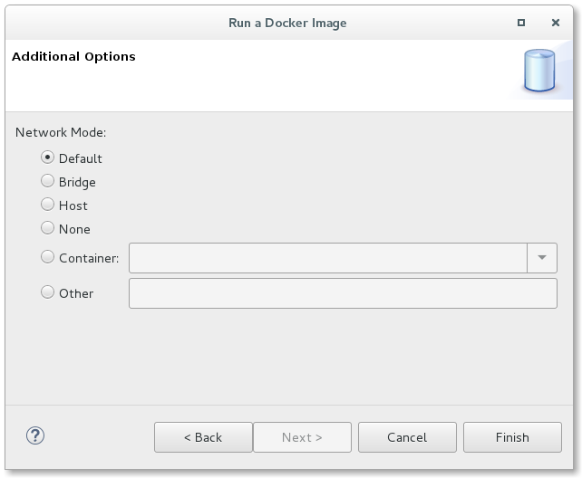
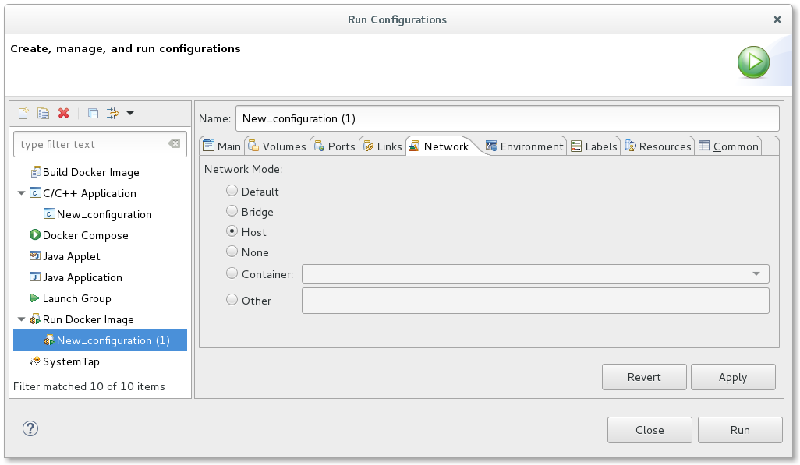
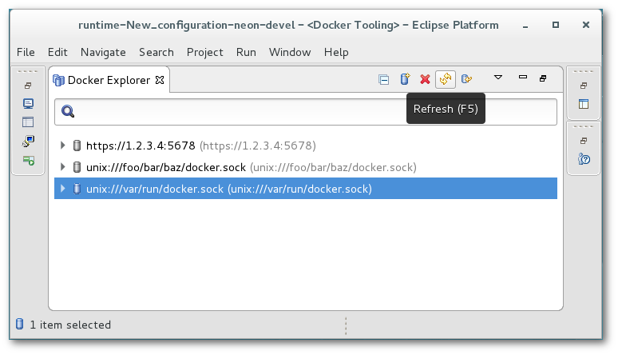

= Docker Tools What's New in 2.3.0
:page-layout: whatsnew
:page-component_id: docker
:page-component_version: 2.3.0
:page-product_id: jbt_core
:page-product_version: 4.4.4.FINAL

== Run Image Network Support

A new page has been added to the Docker Run Image Wizard and Docker Run Image Launch configuration that allows
the end-user to specify the network mode to use.  A user can choose from Default, Bridge, Host, None, Container,
or Other.  If Container is selected, the user must choose from an active Container to use the same network mode.
If Other is specified, a named network can be specified.

== Refresh Connection

Users can now refresh the entire connection from the Docker Explorer View.  Refresh can be performed two ways:

. using the right-click context menu from the Connection
. using the Refresh menu button when the Connection is selected

