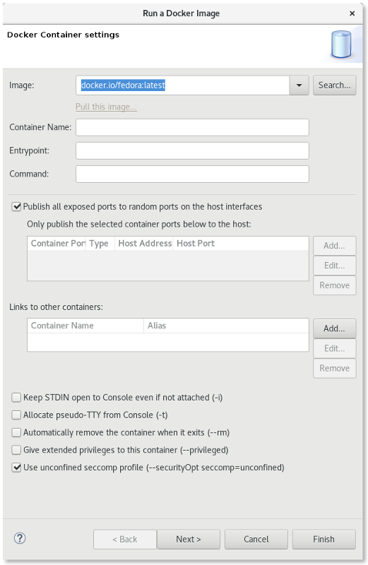
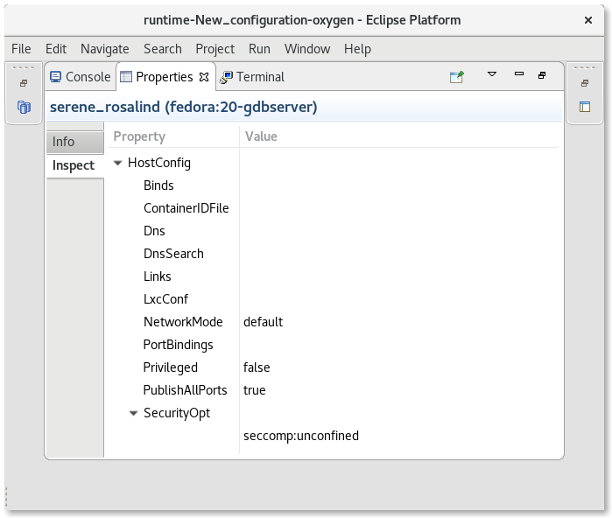

= Docker Tools What's New in 4.5.0.AM2
:page-layout: whatsnew
:page-component_id: docker
:page-component_version: 3.0.0
:page-product_id: jbt_core
:page-product_version: 4.5.0.AM2

== New Security Options

Support has been added when launching commands in a Container to specify a security option profile. This can be done in lieu of specifying privileged mode. For example, to run gdbserver, one can specify "seccomp:unprofiled" to allow ptrace commands to be run by the gdb server.

The Run Image Wizard has been modified to allow specifying an unconfined seccomp profile to replace the default seccomp profile. 

Security options are also now shown in the Properties View.

