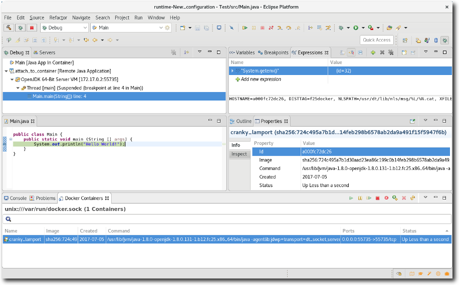

= Docker Tools What's New in 4.5.0.Final
:page-layout: whatsnew
:page-component_id: docker
:page-component_version: 3.1.0
:page-product_id: jbt_core
:page-product_version: 4.5.0.Final

== New Basic Security Option

Support has been added to the Run Image Wizard to add a basic security option.  When chosen, this option behaves the same as using "docker run --cap-drop=all --readonly --tmpfs /run --tmpfs /tmp".  In addition to dropping extraneous capabilities, the basic option makes all non-mounted directories read-only and mounts /run and /tmp into tmpfs which is cleared on each start of the container. 

image::images/docker_oxygen0/LinuxToolsBasicSecurityOption.png[]

== Docker Tooling JDT Integration

The Eclipse Docker Tooling Feature now contains a plugin that integrates with the Java Development Tools (JDT). This permits the running and debugging of Eclipse Java projects within containers. The functionality is provided through the context menu under the 'Run As' and 'Debug As' options. The daemon connection used, as well as the image chosen are configurable through launch configurations.

This is intended to work in the same way that a regular run/debug session works.

