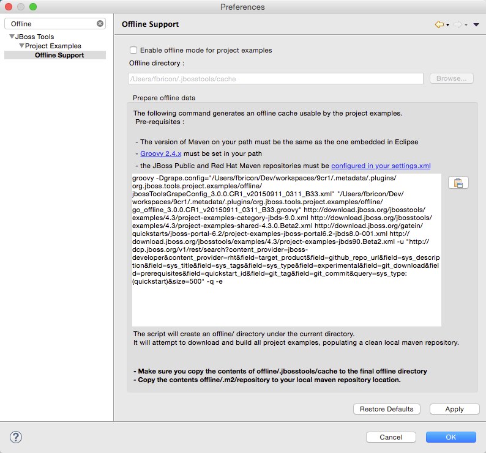

= Project Examples 4.3.0.CR1 What's New
:page-layout: whatsnew
:page-component_id: examples
:page-component_version: 4.3.0.CR1
:page-product_id: jbt_core
:page-product_version: 4.3.0.CR1

== Offline Support for Examples in JBoss Central

As mentioned in link:4.3.0.Beta1.html#central[the JBoss Central section], you now have access to over 200 project
 examples from the JBoss Central page. All these examples and their dependencies can now be cached locally via the
 Groovy Offline script, available from `Preferences` > `JBoss Tools` > `Project Examples` > `Offline Support`.

Groovy 2.4.x is now required to execute the offline script.

Please be aware the script now takes several *hours* to complete (3h on the Red Hat build farm).

related_jira::JBIDE-20077[]
