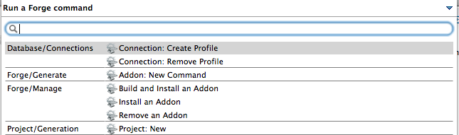
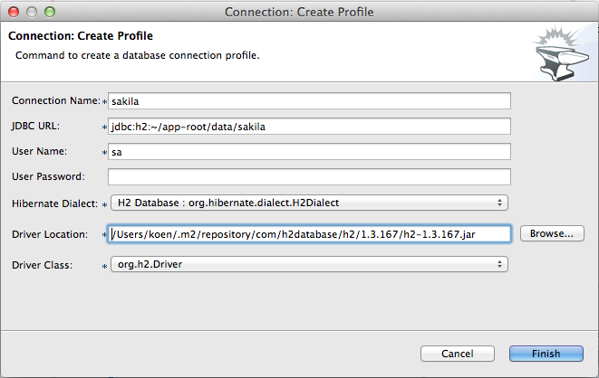
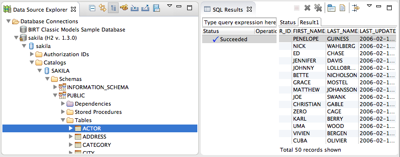
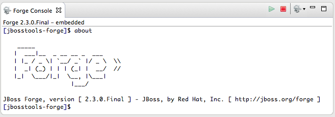
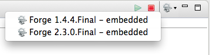
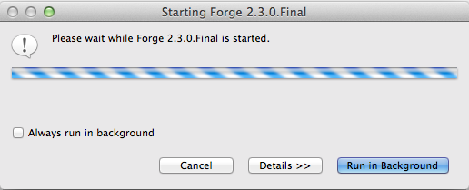
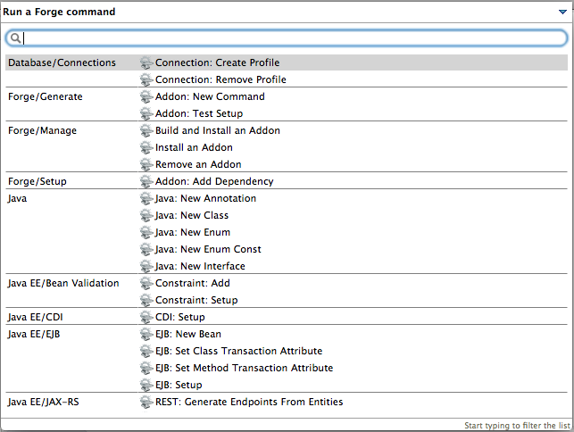

= Forge Tools 4.2.0.Beta1 What's New
:page-layout: whatsnew
:page-component_id: forge
:page-component_version: 4.2.0.Beta1
:page-product_id: jbt_core 
:page-product_version: 4.2.0.Beta1

== Connection Profiles

We provided deep integration between the Forge 2 database add-on and the Eclipse DTP project. Connection profiles created with Forge 2 can be used in DTP and the other way around.

Bring up the connection profile wizard as illustrated below.

Fill out the fields to create the desired connection profile and push ‚Finish’.

Et voilà, you can see the newly created profile in the DTP Data Source Explorer. Moreover you can connect to the data source and view the contents of the tables as illustrated below.

== Embedded Forge Console 	

The embedded Forge console can now also be used with the included Forge 2 runtime. 

You can switch between both consoles using a drop down menu in the Forge console toolbar.

== Forge 2 Runtime 	

Very good news for Forge 2 users! Forge 2 went final in the meantime and we included runtime version 2.3.0.Final.

Lots of useful new commands have been implemented in the meantime. Bring up the list of available commands using the Ctrl+5 (or Cmd+5) keystroke.

== Forge 1 Runtime 	

The embedded Forge 1 runtime is now Forge 1.4.4.Final!

image::images/4.2.0.Beta1/forge144.png[]
