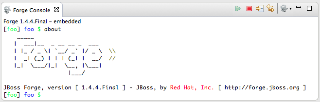

= Forge Tools 4.2.0.Beta1 What's New
:page-layout: whatsnew
:page-component_id: forge
:page-component_version: 4.2.0.Beta1
:page-product_id: jbt_core 
:page-product_version: 4.2.0.Beta1

== Embedded Forge Console 	

The embedded Forge console can now also be used with the included Forge 2 runtime. 

You can switch between both consoles using a drop down menu in the Forge console toolbar.

== Forge 2 Runtime 	

Very good news for Forge 2 users! Forge 2 went final in the meantime and we included runtime version 2.3.0.Final.

Lots of useful new commands have been implemented in the meantime. Bring up the list of available commands using the Ctrl+5 (or Cmd+5) keystroke.

== Forge 1 Runtime 	

The embedded Forge 1 runtime is now Forge 1.4.4.Final!

