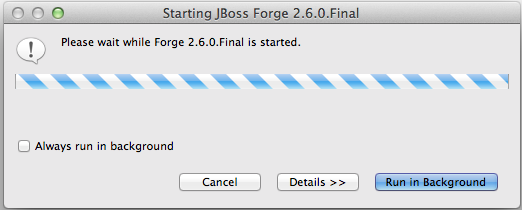

= Forge Tools 4.2.0.Beta2 What's New
:page-layout: whatsnew
:page-component_id: forge
:page-component_version: 4.2.0.Beta2
:page-product_id: jbt_core 
:page-product_version: 4.2.0.Beta2

== Forge 2 Runtime 	

The included Forge 2 runtime is 2.6.0.Final.

Starting the Forge 2 runtime is now done using the Ctrl+4 (or Cmd+4) key combination. 
This key sequence will always start the default Forge runtime.

== Forge 2 Wizards

When Forge 2 is started, hitting the Ctrl+4 (or Cmd+4) key combination brings up a popup with the available Forge wizards. 
These available wizards depend on the currently selected object. The image below illustrates the available wizards when
nothing in particular was selected.

image::images/4.2.0.Beta2/noselection.png

As you can see, there are wizards for creating database connection profiles, for managing Forge addons and for creating
a new project.

When for instance a newly created project is selected while hitting the magic key combination, the popup contains a lot 
more possible wizards become available as illustrated on the image below.

image::images/4.2.0.Beta2/projectselection.png

== Forge 2 Command Line Interface

The wizards above are also available as commands on the command line. Bring up the Forge Console by navigating the  
main Eclipse menu (Window->Show View->Other...->Forge->Forge Console) or by typing in the Quick Access textfield.

The image below illustrates the available commands in the workspace root.

image::images/4.2.0.Beta2/commandline.png
