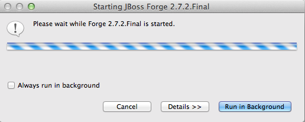
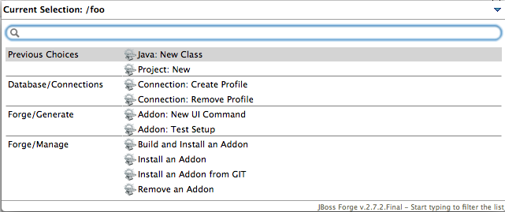
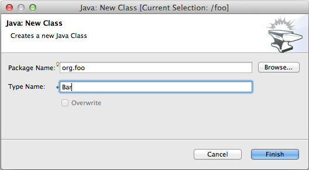

= Forge Tools 4.2.0.Beta3 What's New
:page-layout: whatsnew
:page-component_id: forge
:page-component_version: 4.2.0.Beta3
:page-product_id: jbt_core 
:page-product_version: 4.2.0.Beta3

== Forge 2 Runtime 	

The included Forge 2 runtime is 2.7.2.Final.

== Previous Choices

The popup dialog containing the available Forge commands now shows the most recent choices at the top.

== Current Selection

As shown in the previous image, the popup dialog with the available Forge commands now shows the current
selection from where the popup was opened. Also the wizards that are launched show this current selection
in the title bar.

