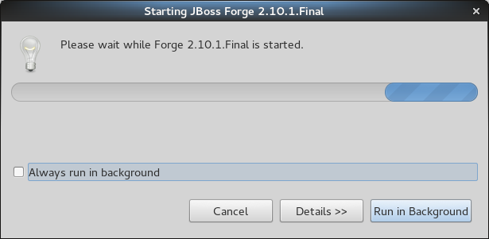
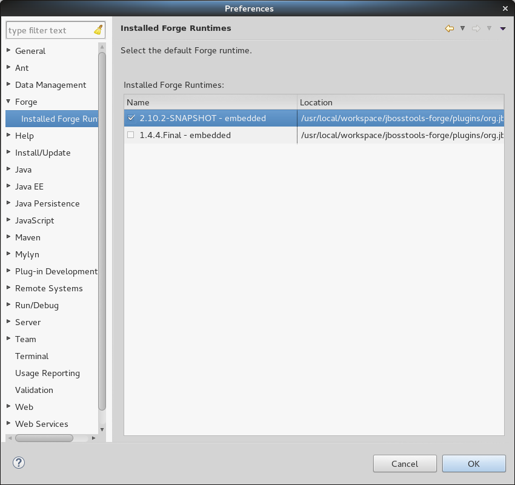
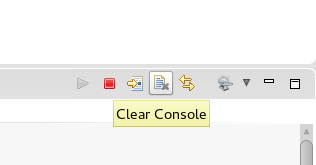
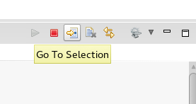
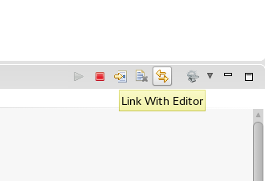

= Forge Tools 4.2.0.CR1 What's New
:page-layout: whatsnew
:page-component_id: forge
:page-component_version: 4.2.0.CR1
:page-product_id: jbt_core 
:page-product_version: 4.2.0.CR1

== Forge 2 Runtime 	

The included Forge 2 runtime is 2.10.1.Final. See the release notes link::http://forge.jboss.org/news/2014-09-12/forge-2.10.1.final-(blazed)-is-here[here]

== "Add Forge Runtime" feature removed for Forge 1.x runtimes

Given that Forge 1.x is feature-frozen for some months now, we decided to remove the "Add Forge Runtime" button in the Forge preferences and keep Forge 1.4.4.Final embedded as the only choice for Forge 1.x users.

== Support for "cd #" and "cd #/PROJECT_NAME"

Now it's possible to use "cd #" to navigate to the workspace location or "cd #/PROJECT_NAME" (where PROJECT_NAME is the name of the target project) to navigate to an existing project inside the current workspace.

== Performance Improvements in "JPA: Generate Entities from Tables" command

A lot of performance improvements were made in the "JPA: Generate Entities from Tables" command. 

== Forge Console view is now available in the JBoss perspective

You can find the Forge Console view in the JBoss perspective by default.

== Added "Clear Console" button to Forge Console

The Forge Console view now features a "Clear Console" button to clear the current output of the console.

== "Go To Selection" and "Link with Editor" are now available in Forge 2 Console

We have added support for the "Go To Selection" (change the current resource in the console to be the selected in Eclipse) and "Link with Editor" (change the selected resource in Eclipse from the console) console actions 

== Support for executing Forge 2 commands in Eclipse cheatsheet files

We have introduced a command to allow execution of Forge 2 commands (as Eclipse Wizards) given its name. The command also allows to pass pre-populated values for the chosen Wizard.

[source:xml]
====
    <command serialization="org.jboss.tools.forge.ui.runForgeCommand(org.jboss.tools.forge.ui.runForgeCommand.commandName=REST: Generate Endpoints From Entities)"/>
====
