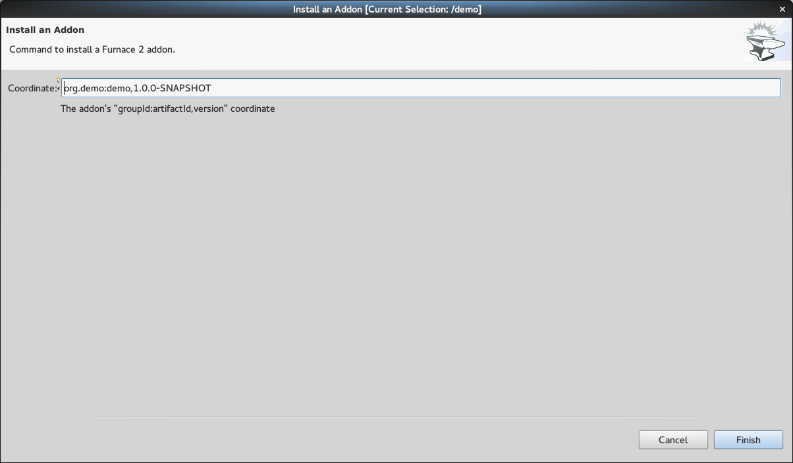

= Forge Tools 4.2.3.CR1 What's New
:page-layout: whatsnew
:page-component_id: forge
:page-component_version: 4.2.3.CR1
:page-product_id: jbt_core 
:page-product_version: 4.2.3.CR1

== Forge 2 Runtime 	

The included Forge 2 runtime is 2.15.1.Final. See the release notes link:https://issues.jboss.org/secure/ReleaseNote.jspa?projectId=12311820&version=12326733[here].

== Support for input component notes

The Forge wizards now render notes below the inputs (where available)

