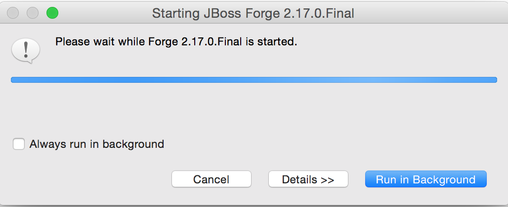

= Forge Tools 4.2.0.Beta2 What's New
:page-layout: whatsnew
:page-component_id: forge
:page-component_version: 4.2.0.Beta2
:page-product_id: jbt_core 
:page-product_version: 4.2.0.Beta2

== Forge 2 Runtime 	

The included Forge runtime is 2.17.0.Final.

Starting the Forge runtime is as always achieved using the Ctrl+4 (or Cmd+4) key combination.

