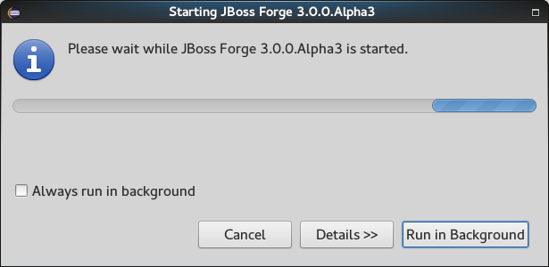

= Forge Tools 4.3.1.Beta1 What's New
:page-layout: whatsnew
:page-component_id: forge
:page-component_version: 4.3.1.Beta1
:page-product_id: jbt_core
:page-product_version: 4.3.1.Beta1

ifndef::finalnn[]
== Forge Runtime updated to 3.0.0.Alpha3

The included Forge runtime is now 3.0.0.Alpha3. You can find the full release notes link:https://issues.jboss.org/secure/ConfigureReport.jspa?versions=12328924&versions=12328768&versions=12324633&sections=all&style=html&selectedProjectId=12311820&reportKey=org.jboss.labs.jira.plugin.release-notes-report-plugin%3Areleasenotes&Next=Next[here].

Major changes::

- Forge now requires JDK 8 to run;
- Commands are now unix-like. Eg. `--targetPackage` was renamed to `--target-package`. This may impact existing scripts and documentation.

Start the Forge runtime using the Ctrl+4 (or Cmd+4) key combination.
endif::finalnn[]
