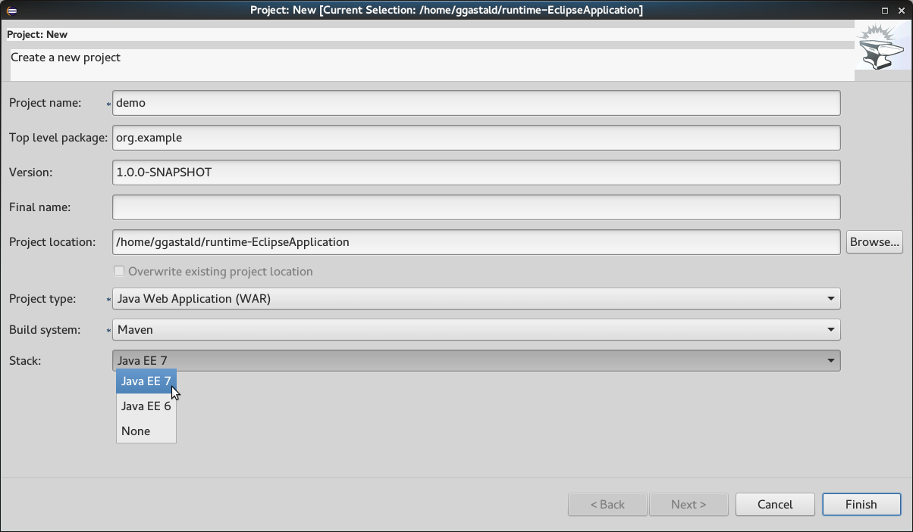

= Forge Tools 4.3.1.Beta2 What's New
:page-layout: whatsnew
:page-component_id: forge
:page-component_version: 4.3.1.Beta2
:page-product_id: jbt_core
:page-product_version: 4.3.1.Beta2

ifndef::finalnn[]
== Forge Runtime updated to 3.0.0.Beta3

The included Forge runtime is now 3.0.0.Beta3. Read the official announcement  http://forge.jboss.org/news/forge-3.0.0.beta3-is-here[here]

endif::finalnn[]

== Labels now display a tooltip

If you hover the label, you will see the same tooltip as when hovering the input field 

== Stack support

Forge now supports choosing a technology stack when creating a project:

Besides setting up your project, choosing a stack will automatically hide some input fields in the existing wizards, like the JPA Version in the `JPA: Setup` wizard:

