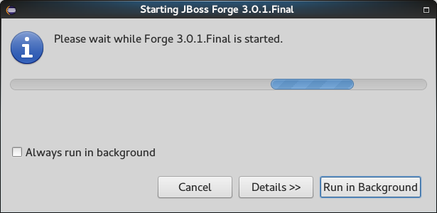
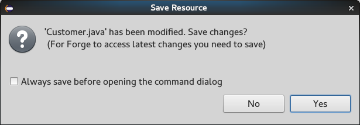
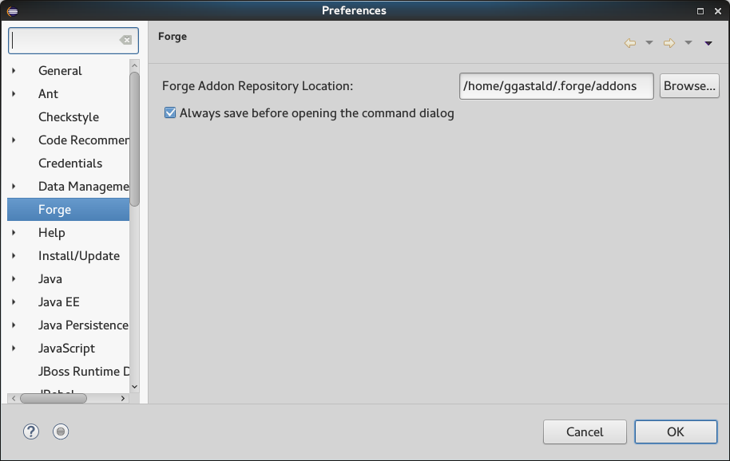

= Forge Tools 4.3.1.CR1 What's New
:page-layout: whatsnew
:page-component_id: forge
:page-component_version: 4.3.1.Final
:page-product_id: jbt_core
:page-product_version: 4.3.1.Final

== Forge Runtime updated to 3.0.1.Final

The included Forge runtime is now 3.0.1.Final. Read the official announcement  http://forge.jboss.org/news/forge-3.0.1.final-is-here[here].

== Prompt user to save the current open editor before executing a command

When `Ctrl` (Or `CMD` in OSX) + `4` are pressed and the file is changed but not yet saved, Forge will display a confirmation dialog asking the user to save the current open file:

You can check the `Always save before opening the command dialog` checkbox to avoid displaying the confirmation dialog. This setting can be changed anytime in the `Preferences` dialog under the `Forge` category: 

