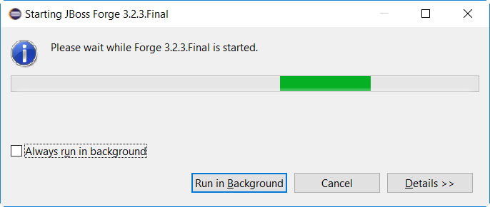

= Forge Tools 4.4.1.AM2 What's New
:page-layout: whatsnew
:page-component_id: forge
:page-component_version: 4.4.1.AM2
:page-product_id: jbt_core
:page-product_version: 4.4.1.AM2

ifndef::finalnn[]
== Forge Runtime updated to 3.2.3.Final

The included Forge runtime is now 3.2.3.Final. Read the official announcement http://forge.jboss.org/news/jboss-forge-3.2.3.final-is-here[here].

endif::finalnn[]
