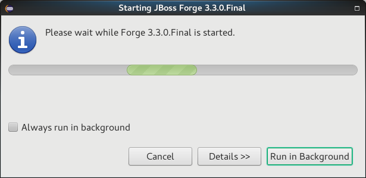
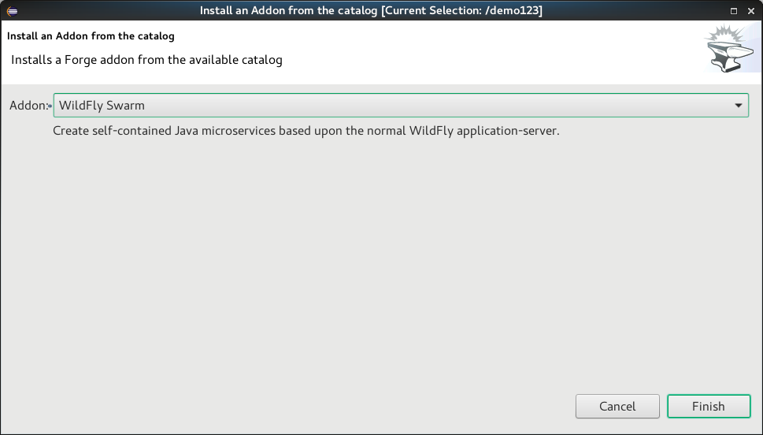

= Forge Tools 4.4.1.AM3 What's New
:page-layout: whatsnew
:page-component_id: forge
:page-component_version: 4.4.1.AM3
:page-product_id: jbt_core
:page-product_version: 4.4.1.AM3

== Forge Runtime updated to 3.3.0.Final

The included Forge runtime is now 3.3.0.Final. Read the official announcement http://forge.jboss.org/news/jboss-forge-3.3.0.final-is-here[here].

== Added Install addon from the catalog command

From Forge 3.3.0.Final onwards it is now possible to query and install addons listed in the http://forge.jboss.org/addons[Forge addons page].

