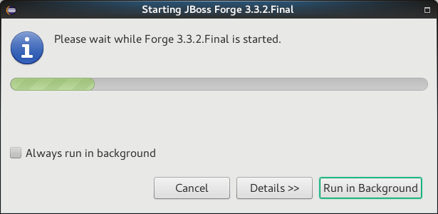
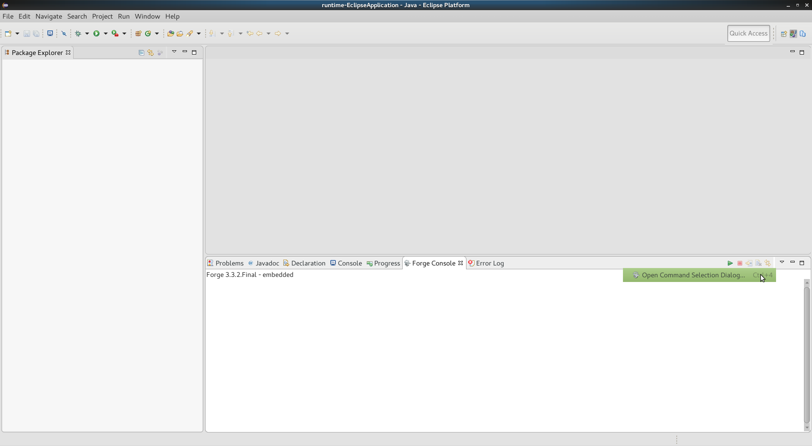

= Forge Tools 4.4.2.AM2 What's New
:page-layout: whatsnew
:page-component_id: forge
:page-component_version: 4.4.2.AM2
:page-product_id: jbt_core
:page-product_version: 4.4.2.AM2

ifndef::finalnn[]
== Forge Runtime updated to 3.3.2.Final

The included Forge runtime is now 3.3.2.Final. Read the official announcement http://forge.jboss.org/news/jboss-forge-3.3.2.final-is-here[here].

endif::finalnn[]

== New Menu in Forge Console view to trigger the Command Selection Dialog

Now it's possible to bring the Command Selection Dialog menu (invoked when Ctrl/Command + 4 is pressed) by choosing the "Open Command Selection Dialog..." menu item in the Forge Console view.

