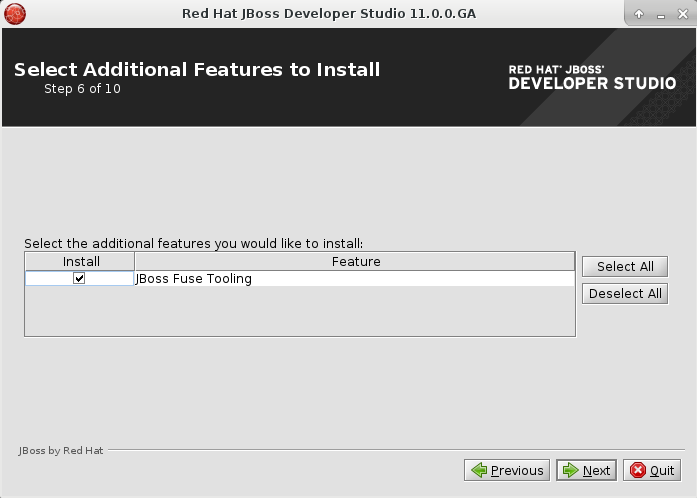

= Fuse Tooling - What's New in 10.0
:page-layout: whatsnew
:page-component_id: fusetools
:page-component_version: 10.0.0
:page-product_id: jbt_core
:page-product_version: 4.5.0.AM2

== Devstudio installer

Fuse Tooling is now available from within the Red Hat JBoss Developer Studio installer, as an additional feature to install.

== Bean Support

We are happy to finally announce support for *Beans* (Spring / Blueprint).

Using the Route Editor you can now access Spring / Blueprint Beans in your Camel Context through the *Configurations* tab.

image::./images/beansupporteditortab.png[Configurations tab in Editor]

In the *Configurations* tab you can see all global configuration elements of your Camel Context. You can ``Add``, ``Edit`` and ``Delete`` elements using the buttons on the right side.

By clicking the ``Add`` or ``Edit`` button a wizard will be opened to guide you on the creation of the Bean.

In the wizard you can select an existing bean class from your project or create a new bean class. You can also specify constructor arguments and bean properties.
Once created you can then modify the properties of that Bean inside the ``Properties`` view.

