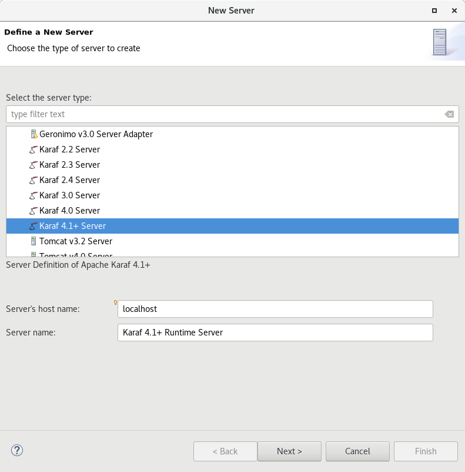
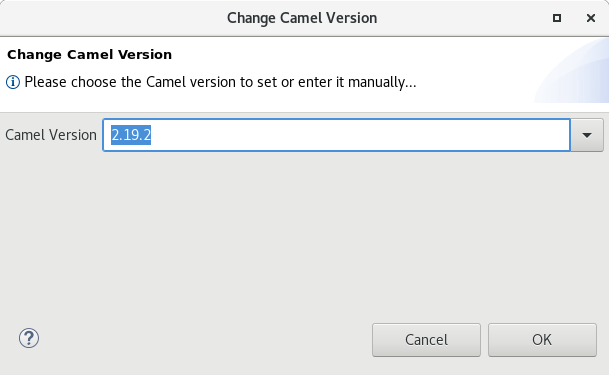
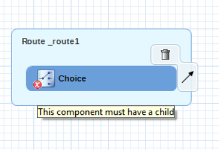

= Fuse Tooling - What's New in 10.1
:page-layout: whatsnew
:page-component_id: fusetools
:page-component_version: 10.1.0.AM2
:page-product_id: jbt_core
:page-product_version: 4.5.1.AM2

== Apache Karaf 4.x Server Adapter

We are happy to announce the addition of new Apache Karaf server adapters. You can now download and install Apache Karaf 4.0 and 4.1 from within your development environment.

== Switch Apache Camel Version

You can now change the Apache Camel version used in your project. To do that you invoke the context menu of the project in the project explorer and navigate into the ``Configure`` menu. There you will find the menu entry called ``Change Camel Version`` which
will guide you through this process.

== Improved Validation

The validation in the editor has been improved to find containers which lack mandatory child elements. (for instance a Choice without a child element)

