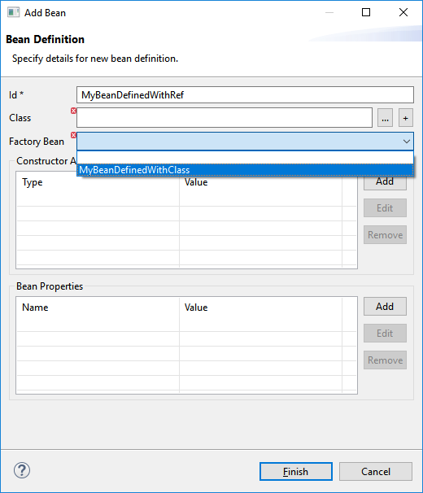
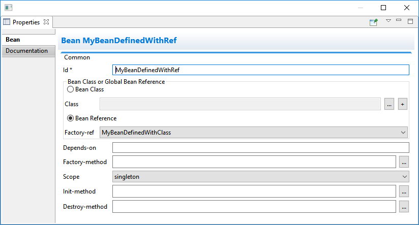

= Fuse Tooling - What's New in 10.1
:page-layout: whatsnew
:page-component_id: fusetools
:page-component_version: 10.1.0.AM3
:page-product_id: jbt_core
:page-product_version: 4.5.1.AM3

== Global Beans: improve support for Bean references

It is now possible to set Bean references from User Interface when creating a new Bean:

Editing Bean references is also now available on the properties view when editing an existing Bean:

Additional validation has been added to help users avoid mixing Beans defined with class names and Beans defined referencing other beans.
