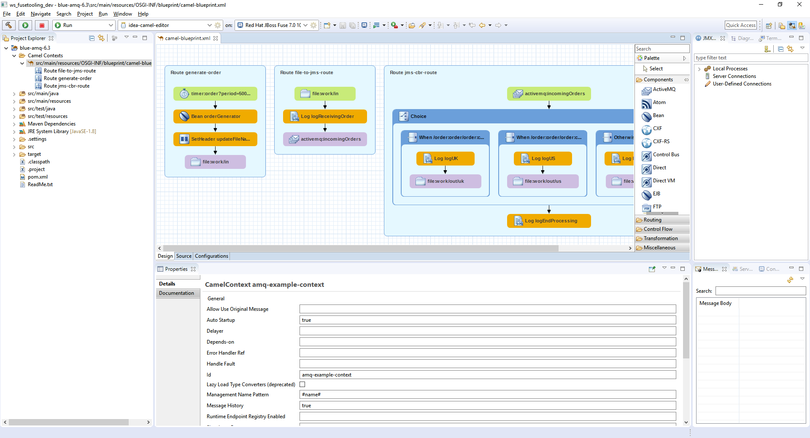

= Fuse Tooling - What's New in 10.2
:page-layout: whatsnew
:page-component_id: fusetools
:page-component_version: 10.2.0.AM1
:page-product_id: jbt_core
:page-product_version: 4.5.2.AM1

== Camel context parameters configurable in properties view for Camel version < 2.18

Before Camel 2.18, the Camel catalog is missing information about Camel Context. Fuse Tooling is now providing this missing piece of information and thus allow to edit Camel Context parameters in Properties view like for any other component. It is activated when there is no element selected on the diagram.

