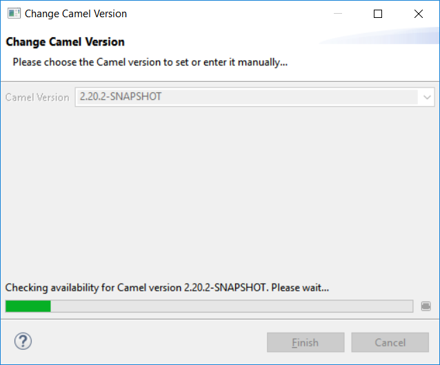

= Fuse Tooling - What's New in 10.2
:page-layout: whatsnew
:page-component_id: fusetools
:page-component_version: 10.2.0.AM2
:page-product_id: jbt_core
:page-product_version: 4.5.2.AM2

== Usability improvement: Progress bar when "Changing the Camel version"

Since Fuse Tooling 10.1.0, it is possible to change the Camel version. In case the Camel version was not cached locally yet and for slow internet connections, this operation can take a while. There is now a progress bar to see the progress.

