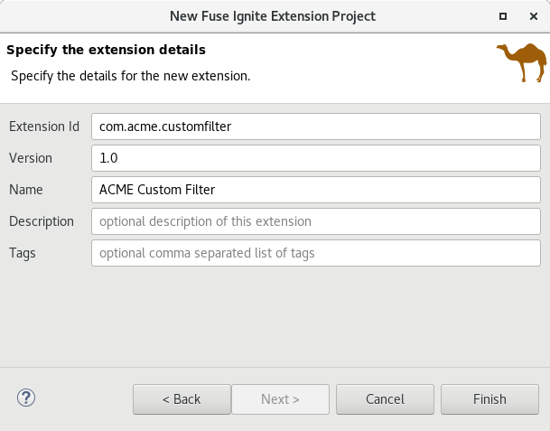
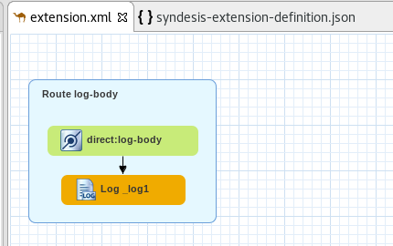
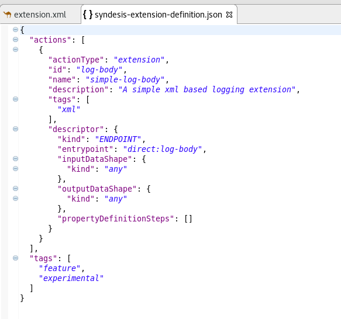

= Fuse Tooling - What's New in 10.2.0.Final
:page-layout: whatsnew
:page-component_id: fusetools
:page-component_version: 10.2.0.Final
:page-product_id: jbt_core
:page-product_version: 4.5.2.Final

== Support for creating Fuse Ignite Technical Extensions

We are happy to announce the addition of support for creating Technical Extension projects for *Fuse Ignite**. That includes the creation of the project using the _"New Fuse Ignite Extension Project"_ wizard as well as support for building the deployable artifact directly from inside the Eclipse environment.

_**Fuse Ignite* is a JBoss Fuse feature that provides a web interface for integrating applications. Without writing code, a business expert can use Ignite to connect to applications and optionally operate on data between connections to different applications. In Ignite, a data operation is referred to as a step in an integration.
Ignite provides steps for operations such as filtering and mapping data. To operate on data in ways that are not provided by Ignite built-in steps, you can develop an Ignite extension to define one or more custom steps.
Fuse Ignite comes as part of https://developers.redhat.com/products/fuse/overview/[Fuse] and https://www.redhat.com/en/explore/fuse-online[Fuse Online]. Please refer to the https://access.redhat.com/documentation/en-us/red_hat_jboss_fuse/7.0-tp/html-single/fuse_ignite_sample_integration_tutorial/index[online documentation] for more information on how to create and configure technical extensions for Fuse Ignite._

The provided project template allows you to define a http://camel.apache.org[Apache Camel] route as base flow of your new technical extension.

To configure your new technical extension you can use the JSON file created with the new project. The JSON Schema for this file can be obtained from https://github.com/syndesisio/syndesis/blob/master/app/rest/model/src/main/resources/syndesis/syndesis-extension-definition-schema.json[Syndesis.io sources].

