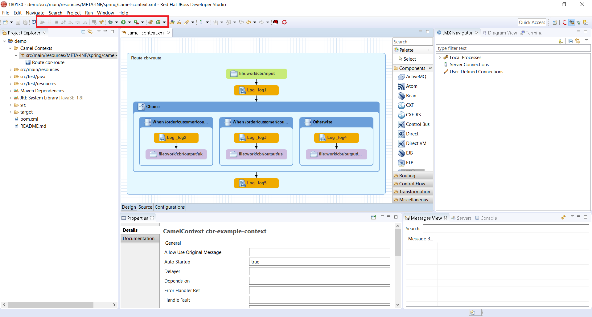
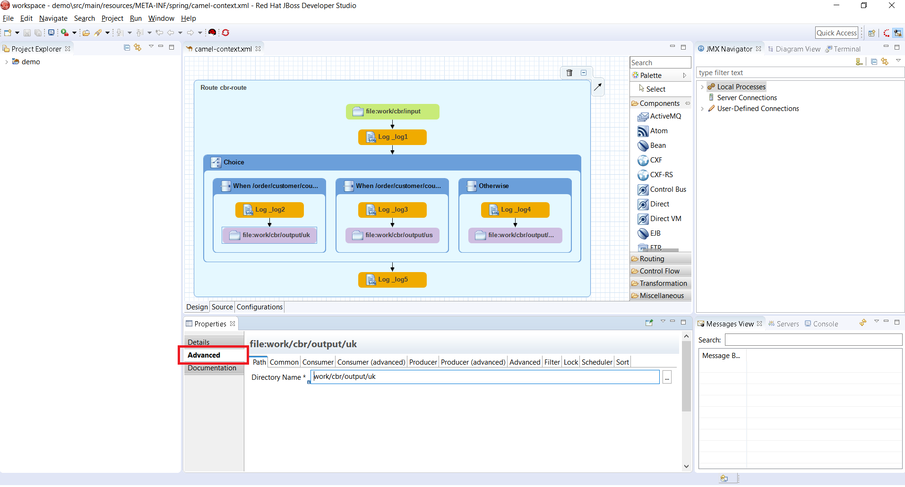

= Fuse Tooling - What's New in 10.3
:page-layout: whatsnew
:page-component_id: fusetools
:page-component_version: 10.3.0.AM1
:page-product_id: jbt_core
:page-product_version: 4.5.3.AM1

== New shortcuts in Fuse Integration perspective

Shortcuts for the Java, Launch, and Debug perspectives and basic navigation operations are now provided within the Fuse Integration perspective.

The result is a set of buttons in the Toolbar:

All of the associated keyboard shortcuts are also available, such as Ctrl+Shift+T to open a Java Type.

== Performance improvement: Loading Advanced tab for Camel Endpoints

The loading time of the "Advanced" tab in the Properties view for Camel Endpoints is greatly improved.

Previously, in the case of Camel Components that have a lot of parameters, it took several seconds to load the Advanced tab. For example, for the File component, it would take ~3.5s. It now takes ~350ms. The load time has been reduced by a factor of 10. (See this interesting https://www.nngroup.com/articles/response-times-3-important-limits/[article on response time])

If you notice other places showing slow performance, you can file a report by using the https://issues.jboss.org/browse/FUSETOOLS[Fuse Tooling issue tracker]. The Fuse Tooling team really appreciates your help. Your feedback contributes to our development priorities and improves the Fuse Tooling user experience.
