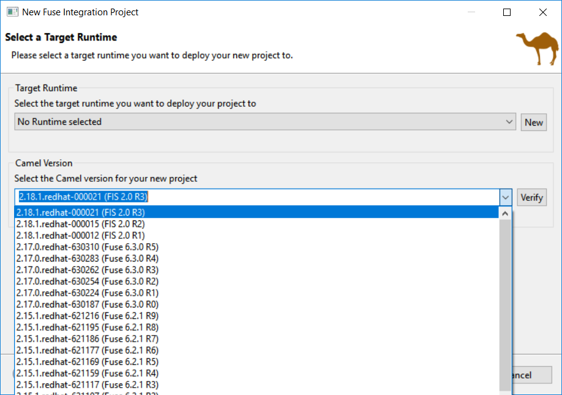
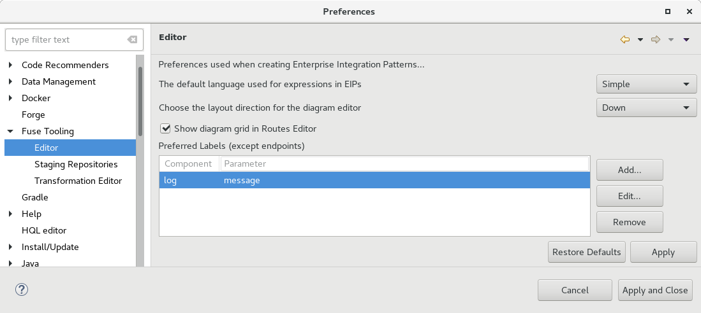
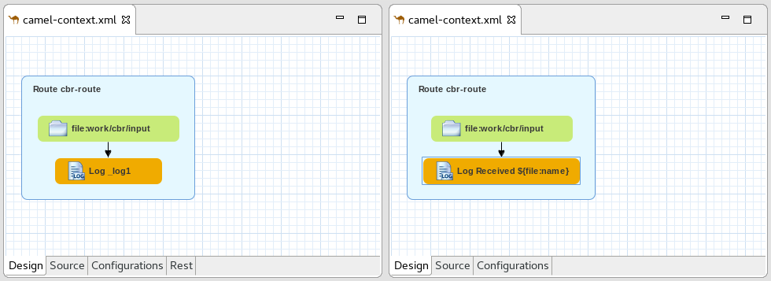

= Fuse Tooling - What's New in 10.3
:page-layout: whatsnew
:page-component_id: fusetools
:page-component_version: 10.3.0.AM2
:page-product_id: jbt_core
:page-product_version: 4.5.3.AM2

== Display Fuse version corresponding to Camel version proposed

When you create a new project, you select the Camel version from a list. Now, the list of Camel versions includes the Fuse version to help you choose the version that corresponds to your production version.

== Update validation for similar IDs between a component and its definition

Starting with Camel 2.20, you can use similar IDs for the component name and its definition unless the specific property "registerEndpointIdsFromRoute" is provided.
The validation process checks the Camel version and the value of the "registerEndpointIdsFromRoute" property.

For example:
[source,xml]
----
<from id="timer" uri="timer:timerName"/>
----

== Improved guidance in method selection for factory methods on Global Bean

When selecting factory method on a Global bean, a lot of possibilities were proposed in the user interface. The list of factory methods for a global bean is now limited to only those methods that match the constraints of the bean's global definition type (bean or bean factory).

== Customize EIP labels in the diagram

When you open the Fuse Tooling preferences page for the editor you will recognize a new list "Preferred Labels" on that page.

This feature enables you to define the displayed title for each EIP available except endpoints.

