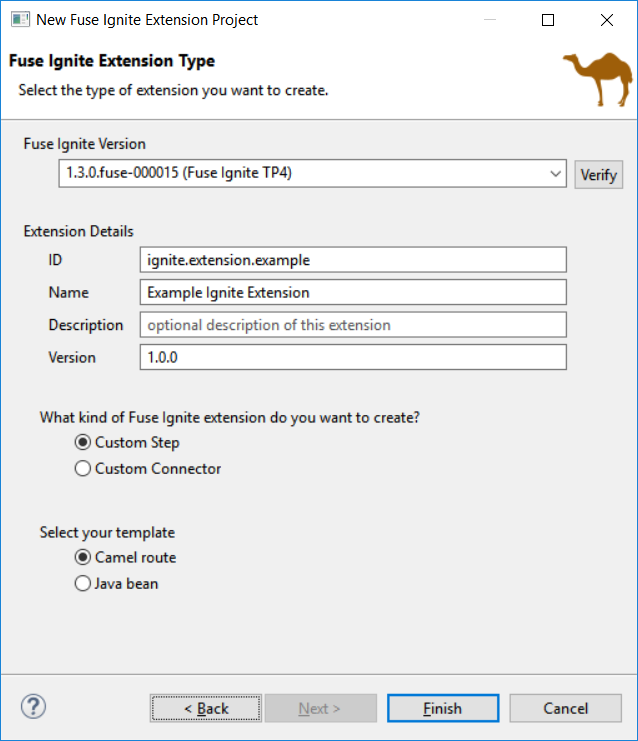
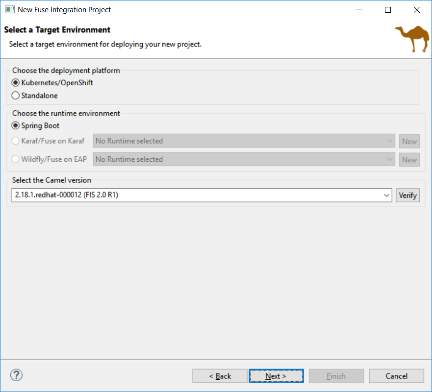
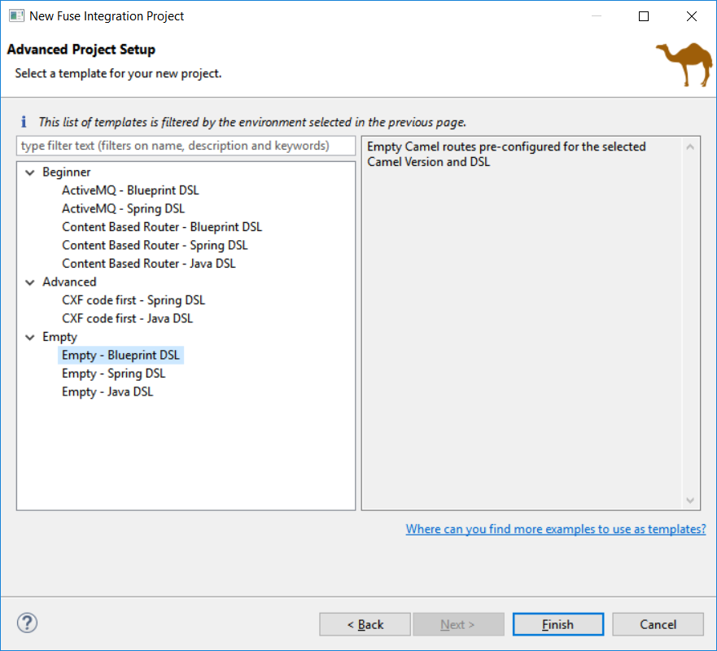
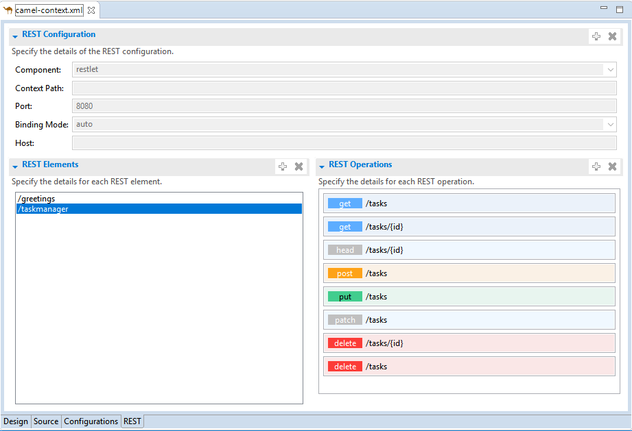

= Fuse Tooling - What's New in 10.3
:page-layout: whatsnew
:page-component_id: fusetools
:page-component_version: 10.3.0.AM3
:page-product_id: jbt_core
:page-product_version: 4.5.3.AM3

== Fuse Ignite Technical Extension templates

The existing template for "Custom step using a Camel Route" has been updated to work with Fuse 7 Tech Preview 4.

Two new templates have been added:
- Custom step using Java Bean
- Custom connector

== Improvements of the wizard to create a Fuse Integration project

The creation wizard provides better guidance for the targeted deployment environment:

More place is available to choose the templates and they are now filtered based on the targeted environment:

It also points out to other places to find different examples for advanced users (see the link at the bottom of the previous screenshot).

== Camel Rest DSL editor (Technical preview)

Camel is providing a Rest DSL to help the integration through Rest endpoints. Fuse Tooling is now providing a new tab in read-only mode to visualize the Rest endpoints defined.

It is currently in Tech Preview and needs to be activated in Window -> Preferences -> Fuse Tooling -> Editor -> Enable Read Only Tech preview REST DSL tab.

Work is still ongoing and feedback is very welcome on this new feature, you can comment on link:https://issues.jboss.org/browse/FUSETOOLS-1287[this JIRA epic].

== Dozer upgrade and migration

When upgrading from Camel < 2.20 to Camel > 2.20, the Dozer dependency has been upgraded to a version not backward-compatible 
If you open a Data transformation based on Dozer in Fuse Tooling, it will propose to migrate the file used for the transformation (technically changing the namespace). It allow to continue to use the Data Transformation editor and have - in most cases - the Data Transformation working at runtime with Camel > 2.20.

