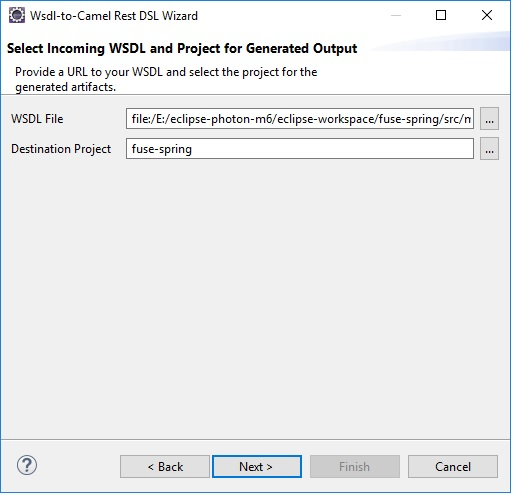
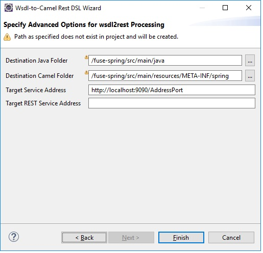
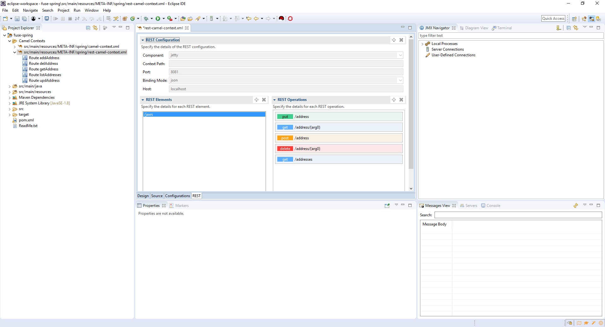
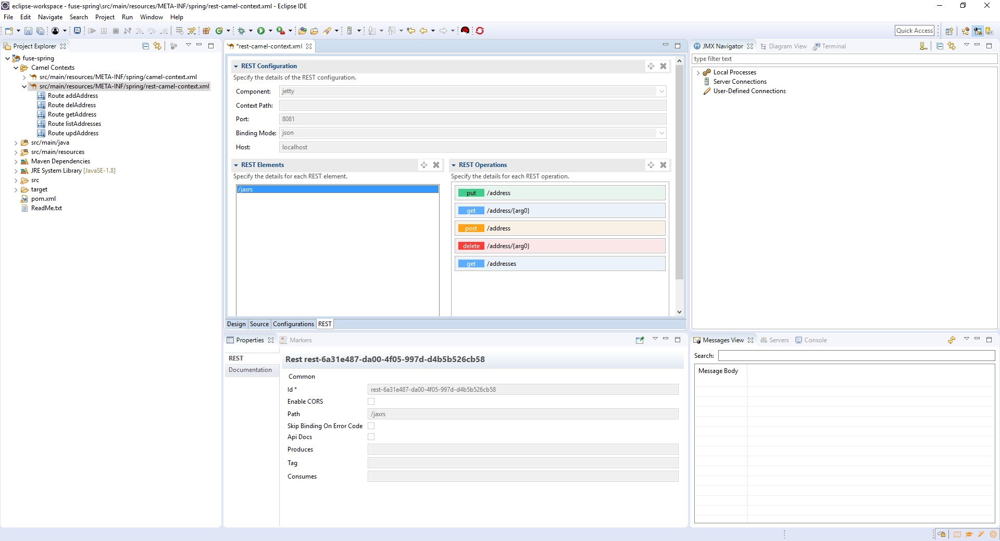
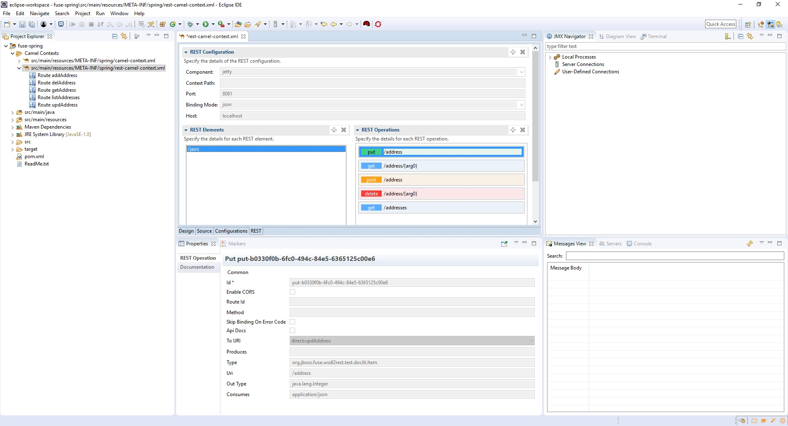

= Fuse Tooling - What's New in 11.0
:page-layout: whatsnew
:page-component_id: fusetools
:page-component_version: 11.0.0.AM2
:page-product_id: jbt_core
:page-product_version: 4.6.0.AM2

== Camel Rest DSL from WSDL wizard

There is a new _"Camel Rest DSL from WSDL"_ wizard. This wizard wraps the wsdl2rest tool now included with the Fuse 7 distribution, which 
takes a WSDL file for a SOAP-based (JAX-WS) web service and generates a combination of CXF-generated code and a Camel REST DSL route to make it accessible using REST operations. 

To start, you need is an existing Fuse Integration project in your workspace and access to the WSDL for the SOAP service. Then use 
_File->New->Other..._ and select _Red Hat Fuse->Camel Rest DSL from WSDL_ wizard. 

On the first page of the wizard, select your WSDL and the Fuse Integration project in which to generate the Java code and Camel configuration. 

On the second page, you can customize the Java folder path for your generated classes, the folder for the generated Camel file, plus any customization for the SOAP service 
address and destination REST service address. 

Click _Finish_ and the new Camel configuration and associated Java code are generated in your project. It automatically knows whether your project is 
Blueprint, Spring, or Spring Boot based, so creates the right artifacts without any additional input. 
When the wizard is finished, you can open your new Camel file in the Fuse Tooling Route Editor and view what it created. 

That brings us to another new functionality, the REST tab in the Fuse Tooling Route Editor.

== Camel Editor REST tab

You'll notice we have a new tab in the Fuse Tooling Route Editor called _"REST"_. For now, this tab is read only, but displays a few bits of information:

- Details for the REST Configuration element, which details the component (jetty, netty, servlet, etc), the context path, the port, binding mode (json, xml, etc.), and host. There is only one REST Configuration element.

- A list of REST elements, which collect REST operations. There may be more than one REST element in a given configuration. Each REST element has an associated property page that displays additional details such as the path, data it consumes or produces, etc.

- And a list of REST operations for a given REST element. Each of these has an associated property page that details the URI, output type, and so on.

Though this page of the editor and its associated property pages are currently read only, we hope they are useful during application development and we plan 
on enabling them in a future release. For now, editing REST DSL can occur directly on the Source tab, and when you return to the REST tab it refreshes to show updated details. 
