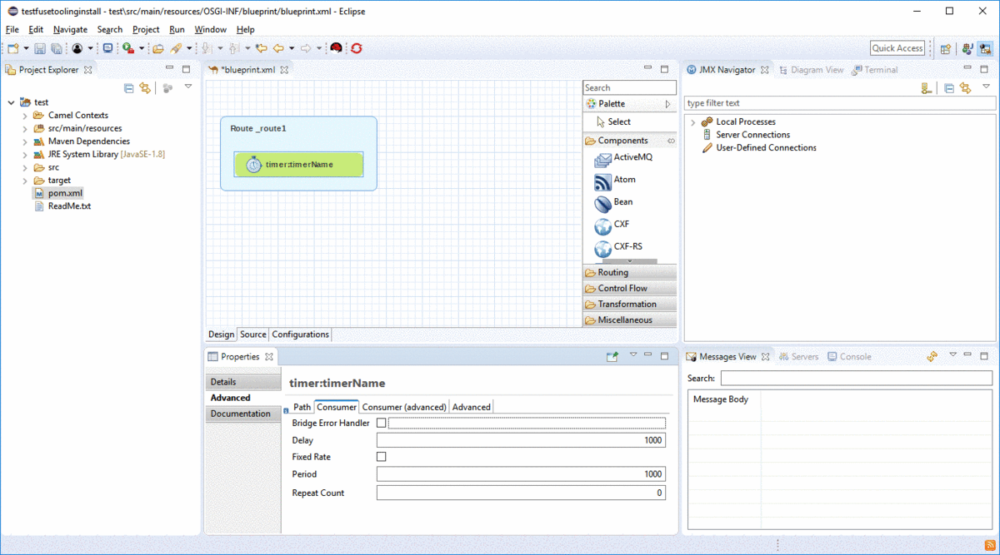

= Fuse Tooling - What's New in 11.0
:page-layout: whatsnew
:page-component_id: fusetools
:page-component_version: 11.0.0.AM3
:page-product_id: jbt_core
:page-product_version: 4.6.0.AM3

== Camel URI completion with xml dsl

As announced link:https://developers.redhat.com/blog/2018/01/31/apache-camel-uri-completion-eclipse-xml-editor/[here], it was already possible to have Camel URI completion with xml dsl in source tab of Camel Route editor by installing link:https://github.com/camel-tooling/camel-lsp-client-eclipse[Language Support for Apache Camel] on your side.

It is now installed by default with Fuse Tooling!

You now have the choice to use the properties view with UI help to configure Camel components or to use textual edition and benefit from completion. All depends on your coding style!

