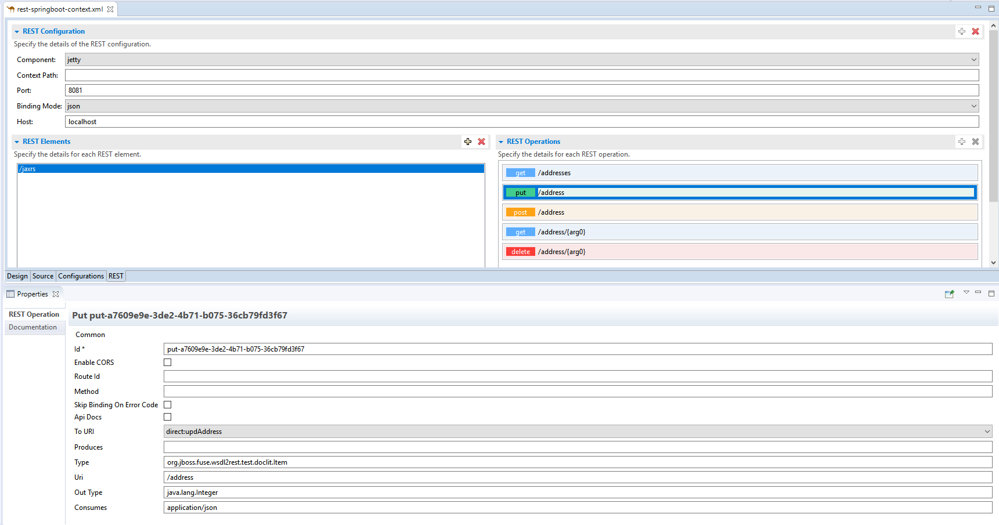

= Fuse Tooling - What's New in 11.1
:page-layout: whatsnew
:page-component_id: fusetools
:page-component_version: 11.1.0.AM1
:page-product_id: jbt_core
:page-product_version: 4.9.0.AM1

ifndef::finalnn[]

== REST Viewer becoming an editor

Previously, there was a REST editor which was read-only. It is useful to have a great overview of already defined Camel REST DSL definitions. Now the editor is also providing editing capabilities allowing to develop faster. It is possible to change parameters of Camel REST operations and Camel REST Elements using the properties tab. It is also possible to create/delete new REST elements with a simple click.

Creation/deletion of Camel REST operations will come in next milestone with several other improvements, stay tuned!

endif::finalnn[]