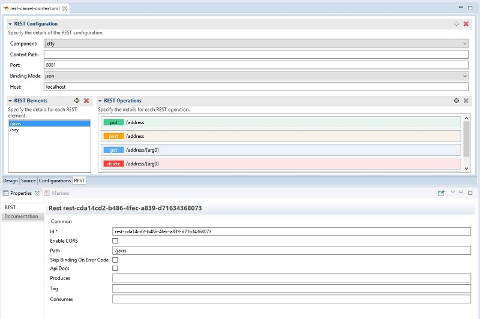

= Fuse Tooling - What's New in 11.1
:page-layout: whatsnew
:page-component_id: fusetools
:page-component_version: 11.1.0.Final
:page-product_id: jbt_core
:page-product_version: 4.9.0.Final
:page-include-previous: false

== REST Viewer becoming an editor

Previously, there was a REST editor which was read-only. It is useful to have a great overview of already defined Camel REST DSL definitions. Now the editor is also providing editing capabilities allowing to develop faster. It is possible to change parameters of Camel REST operations and Camel REST Elements using the properties tab. It is also possible to create/delete new REST elements with a simple click.

image::./images/rest-editable.png[Editable REST Editor]

Creation/deletion of Camel REST operations will come in next milestone with several other improvements, stay tuned!

== WSDL to Camel REST DSL improvements

The version of the library used to generate Camel REST DSL from WSDl files has been updated. It now covers more types of WSDL files. See https://github.com/jboss-fuse/wsdl2rest/milestone/3?closed=1 for the list of improvements.

== REST Editor tab improvements

In the last milestone we began adding editing capabilities to the read-only REST tab to the route editor we added in the previous release. Those efforts have continued and we now have a fully editable REST tab.

You can now:

* Create and delete REST Configurations
* Create and delete new REST Elements
* Create and delete new REST Operations
* Edit properties for a selected REST Element in the Properties view
* Edit properties for a selected REST Operation in the Properties view

In addition, we've improved the look and feel by fixing the scrolling capabilities of the REST Element and REST Operations lists. 
