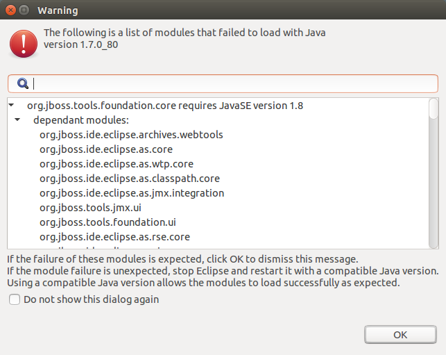

= General 4.3.0.Beta1 What's New
:page-layout: whatsnew
:page-component_id: general
:page-component_version: 4.3.0.Beta1
:page-product_id: jbt_core
:page-product_version: 4.3.0.Beta1

== Java 8 requirement

Java 8 is now a minimum requirement to *run* JBoss Tools.
JBoss Tools continues to support running servers and applications with older Java versions.

If JBoss Tools is run on an older Java version, a warning dialog appears:

related_jira::JBIDE-19500[]
