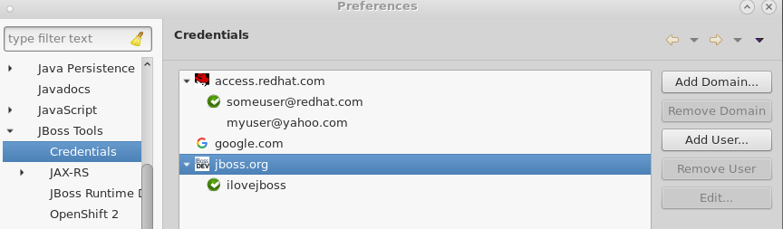
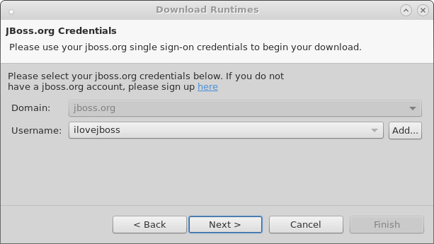

= General 4.3.1.Beta1 What's New
:page-layout: whatsnew
:page-component_id: general
:page-component_version: 4.3.1.Beta1
:page-product_id: jbt_core
:page-product_version: 4.3.1.Beta1

== Improvements on the Importer wizard

The Import wizard that you can access via _File > Import Projects from Folder..._, _File > Import... > General > Projects from Folder_ or _File > Import... > Git > Projects from Git (auto-import)_ allows more user control. You can now see a proposal for the import (what will be imported and how) and select which sub-projects to import or exclude.

Performance is also significantly improved, and importing a Maven project will now suggest installation of m2e connectors when necessary.

== Credentialing Framework

A new feature has been added to safely store your credentials for various domains in a central location. As our tools grow, credential re-use by several different features is required. Having a central place to store, for example, your Red Hat Access credentials or JBoss.org credentials, for re-use by our server adapters or download-runtime features helps to prevent you from having to constantly type the same usernames and passwords in multiple locations. It also helps to ensure that if you change your password on some remote server, you only need to update one location in eclipse.

To access the central credential storage, browse to Window > Preferences > JBoss Tools / Credentials. From there, add custom domains for which you wish to store credentials, or add username/password combinations to the two pre-existing domains: access.redhat.com and jboss.org.

At this time, only `Download Runtimes` and the new (experimental) `CDK Server Adapter` use this new framework. However, usage is expected to increase in the future across the toolset as the tool matures.
