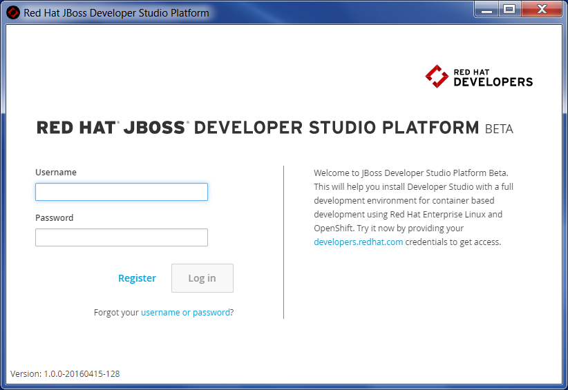

= General What's New in 4.3.1.Final
:page-layout: whatsnew
:page-component_id: general
:page-component_version: 4.3.1.Final
:page-product_id: jbt_core
:page-product_version: 4.3.1.Final

== New Installer for Container Based Development Environment 

A new Windows installer is available now to help you install Developer Studio with a full development environment for container based development using Red Hat Enterprise Linux and OpenShift.

The Installer currently only works on 64-bit Windows only and is currently available as a Technology Preview.

The Red Hat JBoss Developer Studio Platform installer sets up the following components on your machine:

- Red Hat JBoss Developer Studio

- Red Hat Container Development Kit

- Vagrant

- VirtualBox

- OpenJDK

- Cygwin

- OpenShift Client (OC) Tools

Please register on http://developers.redhat.com/[developers.redhat.com] to get access to the Platform.

Here is a short demo of the new installer: https://youtu.be/dMWAguol3as

*Important:* Ensure that Virtualization is enabled in the BIOS settings for your machine. This is required to run VirtualBox and Vagrant. For further information, consult your system's documentation for instructions to change BIOS settings.