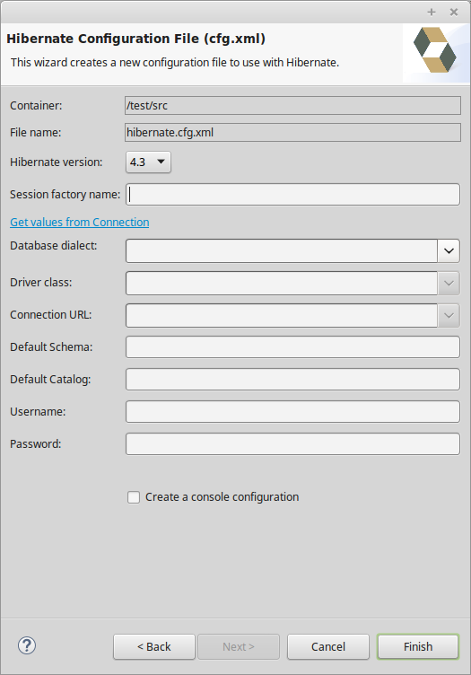

= Hibernate Tools 4.3.0.CR1 What's New
:page-layout: whatsnew
:page-component_id: hibernate
:page-component_version: 5.0.0.CR1
:page-product_id: jbt_core
:page-product_version: 4.3.0.CR1

== Hibernate Runtime Version Updates

The following new core Hibernate Tools releases have been published:

* 3.5.1.Final: This version was build using the 3.5.6.Final version of Hibernate ORM.
* 3.6.0.Final: This version was build using the 3.6.10.Final version of Hibernate ORM.
* 4.0.0.Final: This version was build using the 4.0.1.Final version of Hibernate ORM.
* 4.3.1.Final: This version was build using the 4.3.10.Final version of Hibernate ORM.

These four new releases with their specific Hibernate ORM dependencies have been included in the corresponding Hibernate runtime provider plugins in the 4.3.0.CR1 release of JBoss Tools.

== Hibernate Configuration File Wizard

The wizard to create new Hibernate configuration files (*.cfg.xml) now supports multiple Hibernate versions. 

A new dropdown box now allows for the selection of the desired Hibernate version.

related_jira::JBIDE-20412[]