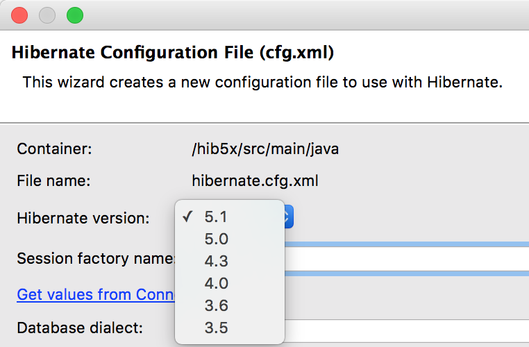
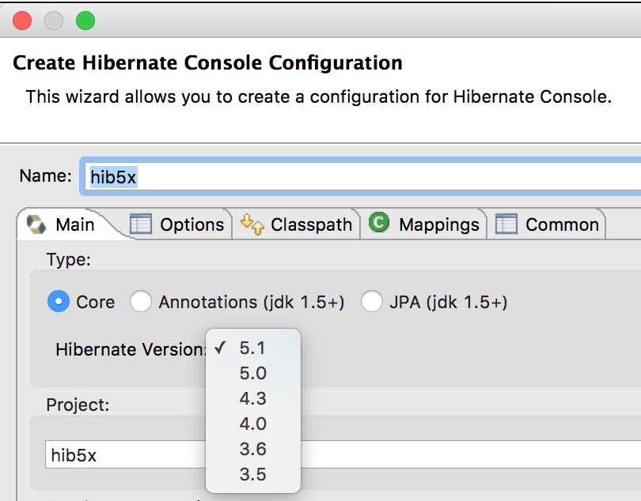

= Hibernate Tools 4.3.1.Final What's New
:page-layout: whatsnew
:page-component_id: hibernate
:page-component_version: 5.0.1.Final
:page-product_id: jbt_core
:page-product_version: 4.3.1.Final

== Hibernate 5 Support

Two new runtime providers for Hibernate where added with in 4.3.1.Final. Both these new versions can be selected in the relevant wizards.

{empty} +

=== Hibernate 5.0 Runtime Provider 

This runtime includes the 5.0.8.Final version of Hibernate ORM and the 5.0.0.Alpha3 version of Hibernate Tools Core which was build using the 5.0.8.Final version of Hibernate ORM.

=== Hibernate 5.1 Runtime Provider

This runtime includes the 5.1.0.Final version of Hibernate ORM and the 5.1.0.Alpha1 version of Hibernate Tools Core which was build using the 5.1.0.Final version of Hibernate ORM.

related_jira::JBIDE-22091[]