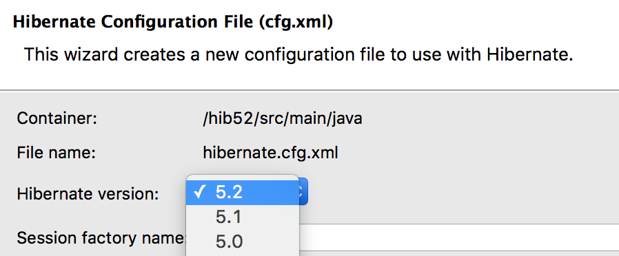

= Hibernate Tools 4.4.1.Final What's New
:page-layout: whatsnew
:page-component_id: hibernate
:page-component_version: 5.1.1.Final
:page-product_id: jbt_core
:page-product_version: 4.4.1.Final

== Hibernate Runtime Provider Updates

A number of additions and updates have been performed on the available Hibernate runtime  providers.

=== New Hibernate 5.2 Runtime Provider

With final releases available in the Hibernate 5.2 stream, the time was right to make available a corresponding Hibernate 5.2 runtime provider. This runtime provider incorporates Hibernate Core version 5.2.2.Final and Hibernate Tools version 5.2.0.Beta1.  

=== Other Runtime Provider Updates

The Hibernate 4.3 runtime provider now incorporates Hibernate Core version 4.3.11.Final and Hibernate Tools version 4.3.5.Final.

{empty}

The Hibernate 5.0 runtime provider now incorporates Hibernate Core version 5.0.10.Final and Hibernate Tools version 5.0.2.Final.

{empty}

The Hibernate 5.1 runtime provider now incorporates Hibernate Core version 5.1.1.Final and Hibernate Tools version 5.1.0.CR1.

