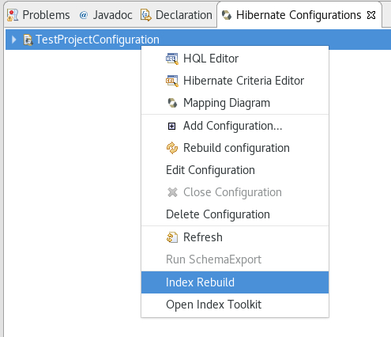
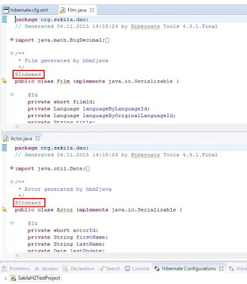
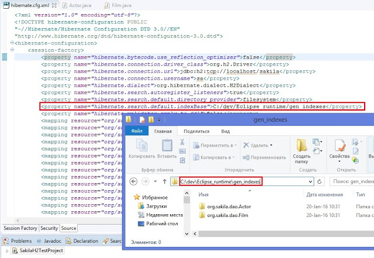
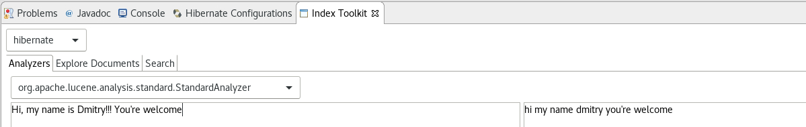
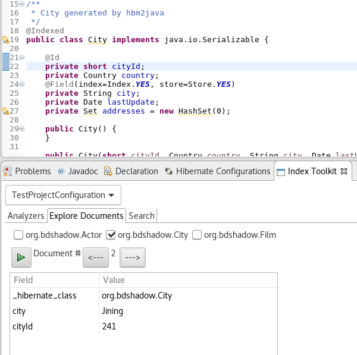
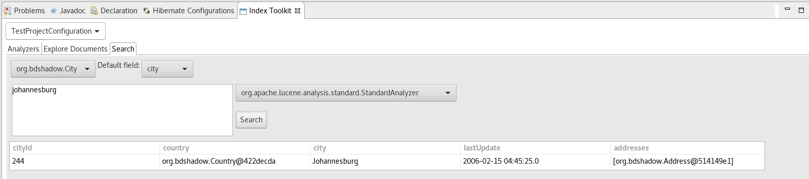

= Hibernate Tools 4.5.0.AM1 What's New
:page-layout: whatsnew
:page-component_id: hibernate
:page-component_version: 4.5.0.AM1
:page-product_id: jbt_core
:page-product_version: 4.5.0.AM1

== Hibernate Search Support

We are glad to announce the support of the http://hibernate.org/search[Hibernate Search]. The project was started by https://github.com/bdshadow[Dmitrii Bocharov] in the https://developers.google.com/open-source/gsoc/[Google Summer Code] program and has been successfully transferred in the current release of the JBoss Tools from https://github.com/bdshadow/jbosstools-hibernate-search[Dmitrii's repository] into the https://github.com/jbosstools/jbosstools-hibernate[jbosstools-hibernate repository] and has become a part of the JBoss family of tools. 

=== Functionality

The plugin was thought to be some kind of a https://github.com/DmitryKey/luke[Luke tool] inside Eclipse.
It was thought to be more convenient than launching a separate application, and picks up the configuration directly from your Hibernate configuration.

Two options were added to the console configurations submenu: Index Rebuild and Index Toolkit. They become available when you use hibernate search libraries (they exist in the build path of your application, e.g. via maven).

=== Index Rebuild

When introducing Hibernate Search in an existing application, you have to create an initial Lucene index for the data already present in your database.

The option "Index Rebuild" will do so by re-creating the Lucene index in the directory specified by the `hibernate.search.default.indexBase` property.

=== Index Toolkit

"Open Index Toolkit" submenu of the console configuration opens an "Index Toolkit" view, which has three tabs: Analyzers, Explore Documents, Search.

==== Analyzers

This tab allows you to view the result of work of different Lucene Analyzers.
The combo-box contains all classes in the workspace which extend org.apache.lucene.analysis.Analyzer, including custom implementations created by the user. While you type the text you want to analyse, the result immediately appears on the right.

==== Explore Documents

After creating the initial index you can now inspect the Lucene Documents it contains.

All entities annotated as `@Indexed` are displayed in the Lucene Documents tab.
Tick the checkboxes as needed and load the documents. Iterate through the documents using arrows.

==== Searching

The plugin passes the input string from the search text box to the QueryParser which parses it using the specified analyzer and creates a set of search terms, one term per token, over the specified default field. The result of the search pulls back all documents which contain the terms and lists them in a table below.

== Demo
video::aFPijD3zutM[youtube]

