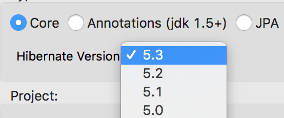

= Hibernate Tools 4.5.3.AM3 What's New
:page-layout: whatsnew
:page-component_id: hibernate
:page-component_version: 4.5.3.AM3
:page-product_id: jbt_core
:page-product_version: 4.5.3.AM3

== Hibernate Runtime Provider Updates

A number of additions and updates have been performed on the available Hibernate runtime  providers.

=== New Hibernate 5.3 Runtime Provider

With beta releases available in the Hibernate 5.3 stream, the time was right to make available a corresponding Hibernate 5.3 runtime provider. This runtime provider incorporates Hibernate Core version 5.3.0.Beta2 and Hibernate Tools version 5.3.0.Beta1.  

=== Other Runtime Provider Updates

The Hibernate 5.0 runtime provider now incorporates Hibernate Core version 5.0.12.Final and Hibernate Tools version 5.0.6.Final.

{empty}

The Hibernate 5.1 runtime provider now incorporates Hibernate Core version 5.1.12.Final and Hibernate Tools version 5.1.7.Final.

{empty}

The Hibernate 5.2 runtime provider now incorporates Hibernate Core version 5.2.15.Final and Hibernate Tools version 5.2.10.Final.

