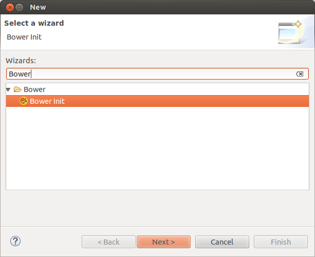
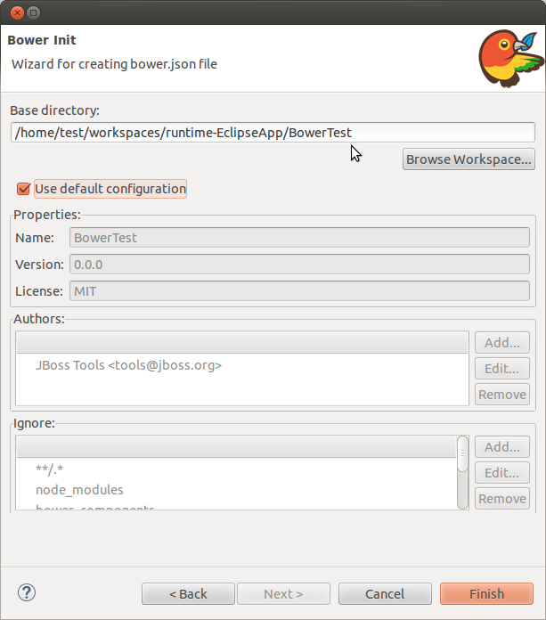
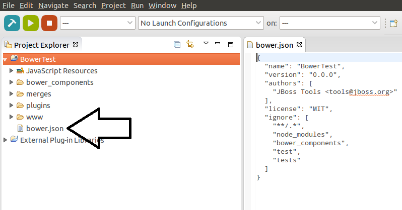
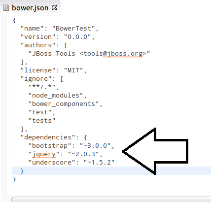
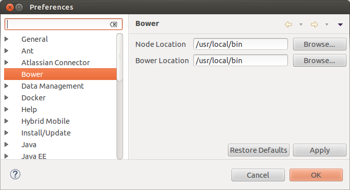
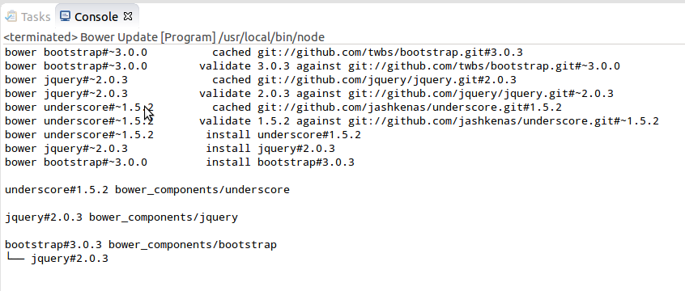
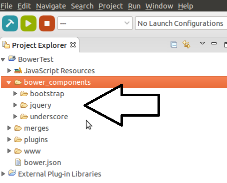

= JavaScript Tools What's New in 4.3.0.Beta2
:page-layout: whatsnew
:page-component_id: javascript
:page-component_version: 4.3.0.Beta2
:page-product_id: jbt_core
:page-product_version: 4.3.0.Beta2
:experimental true

== Bower support

We are happy to introduce brand new http://bower.io/[Bower] Tools. Bower is a front-end package manager which works by fetching and installing frameworks, libraries, assets. Bower keeps track of these packages in a manifest file, `bower.json`  

=== Pre-Requirements

JBoss Bower Tools fall back on *native*  Node.js and Bower calls. Hence, the following software must be pre-installed:

* Node.js
* npm
* Bower

TIP: Installation instructions for *Node.js* and *npm* can be found https://docs.npmjs.com/getting-started/installing-node[here]. Bower is a command line utility which is installed via npm command `npm install -g bower`

=== User Manual

For now only *http://bower.io/docs/api/#init[init]* and *http://bower.io/docs/api/#update[update]* commands of Bower API are supported. In order to initialize Bower one need to select *File -> New... -> Other...* and choose *Bower Init* wizard:

This wizard helps to create `bower.json` file depending on set of preferences:
 

After pressing *"Finish"* button `bower.json` will be created under specified directory:

In order to add new dependencies one need to specify them in `bower.json`:

For updating dependencies user should right-click on the `bower.json` -> *Run As...* -> *Bower Update*

TIP: In most cases *Bower* and *Node.js* will be detected in the system automatically. However, if the detection failed warn dialog will be shown for specifying location in preferences:

*"Bower Update"* launch shortcut makes a native call which will install required packages or update them to the newest version according to `bower.json`:

Specified packages will be created under `bower_components` folder after *"Bower Update"* execution:

Basically, that is all - one can now use those packages for future front-end development.

related_jira::JBIDE-19795[]
