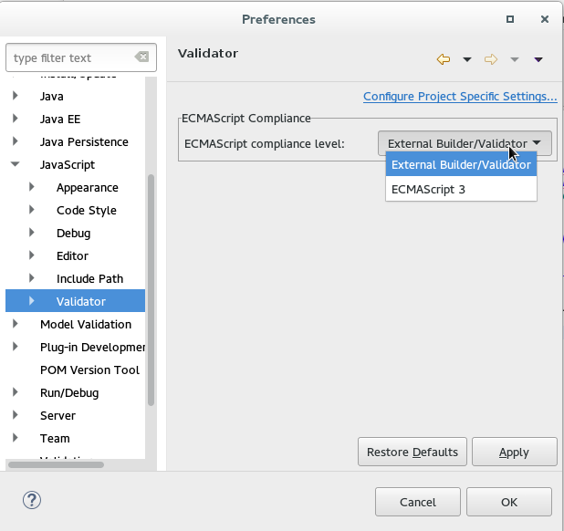

= JavaScript Tools What's New in 4.3.0.CR1
:page-layout: whatsnew
:page-component_id: javascript
:page-component_version: 4.3.0.CR1
:page-product_id: jbt_core
:page-product_version: 4.3.0.CR1
:experimental true

== JavaScript Editing improvments

Target Platform is updated with the lates Tern.java and AngularJS-Eclipse in order to bring the latest improvments and fixes of JavaScript Content Assistant into JBoss Tools.

* Tern.java v.1.0.0.201508302102
* AngularJS-Eclipse v.1.0.0.201508312121

Check out its new and noteworthy:

- https://github.com/angelozerr/tern.java/wiki/New-and-Noteworthy-1.0.0[Tern.java 1.0.0 New and Noteworthy]
- https://github.com/angelozerr/angularjs-eclipse/wiki/New-and-Noteworthy-1.0.0[AngularJS Eclipse Plugin 0.10.0 New and Noteworthy]

Note: These features are available via JBoss Central - Early Access as a part of *AngularJS for Web Tools*

related_jira::JBIDE-20545[]

== JavaScript Development Tools improvements

JSDT now provides an option to turn off internal parsing and validation which could be useful for users who work with big projects where JavaScript is not the main part ov development by reducing the memory/performance requirements. Also the option could be useful when JSDT is used with 3rd-party tools those provide Content Assisting and Validation for JavaScripts.

For such a projects the "External Builder/Validator" mode can be selected for ECMAScript compliance level preference on Window->Preferences->JavaScript->Validator preference page:

See: https://bugs.eclipse.org/bugs/show_bug.cgi?id=472754[Bug 472754 - Provide a way to turn off any parsing/validation/search indexing by internal JSDT parser]
