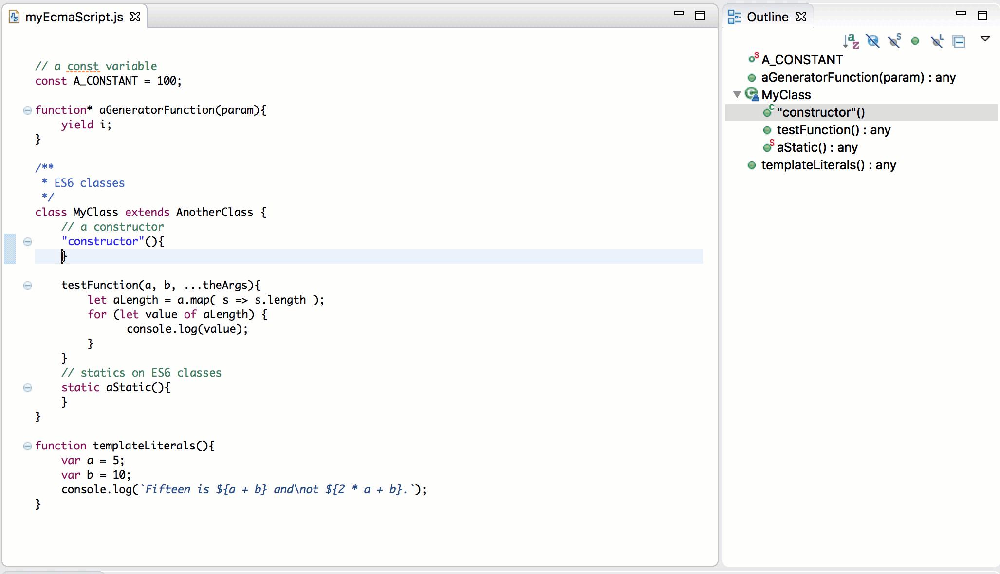
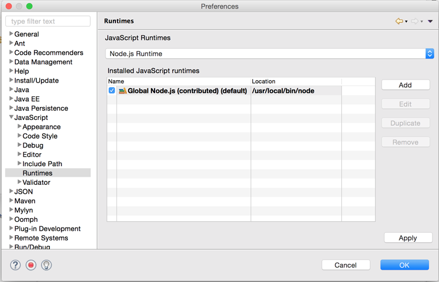
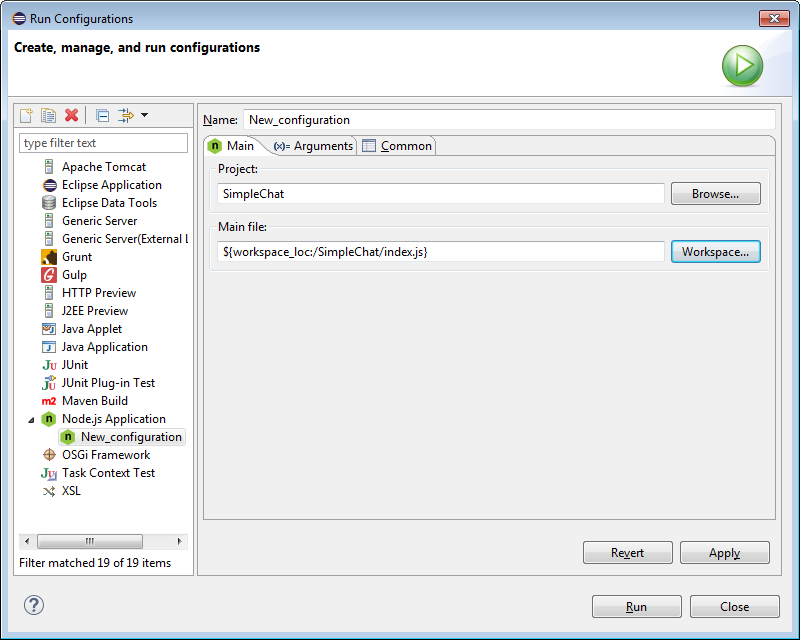
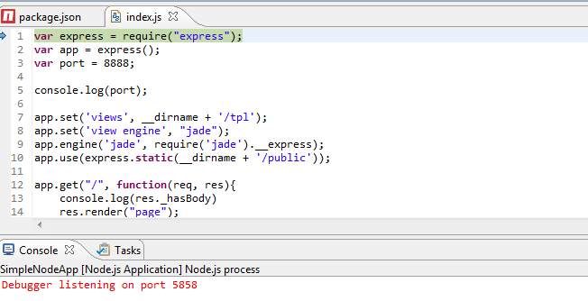
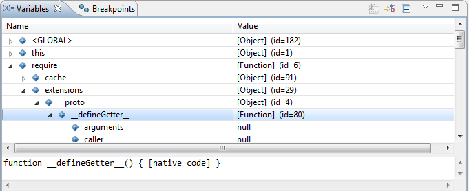
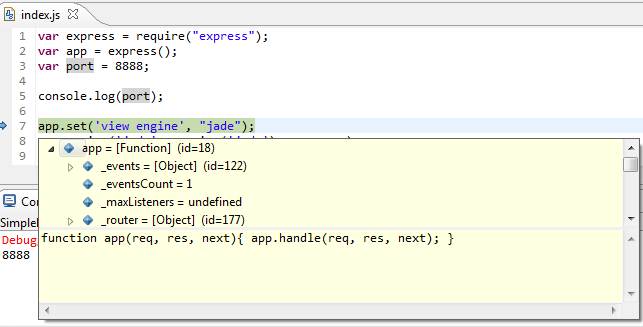
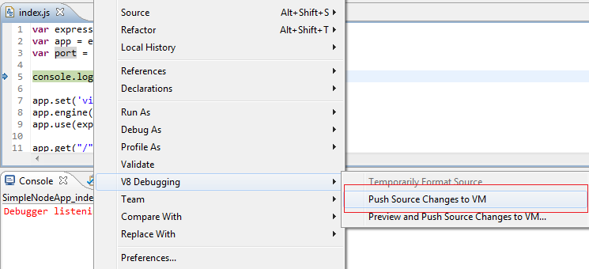
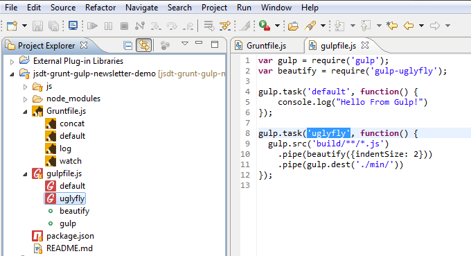
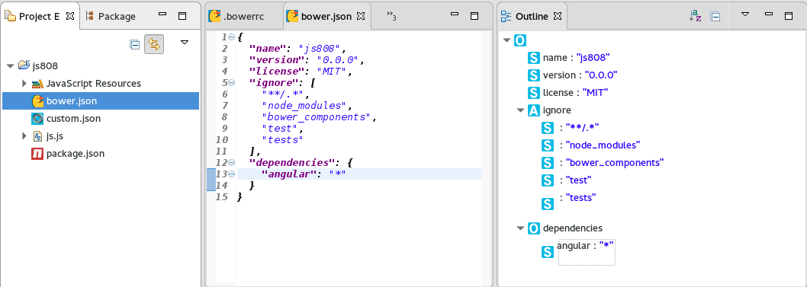
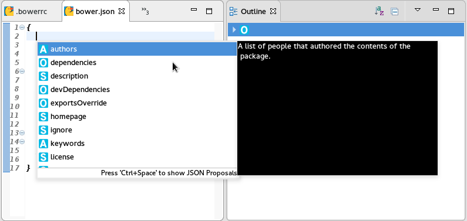

= JavaScript Tools What's New in 4.4.0.Alpha2
:page-layout: whatsnew
:page-component_id: javascript
:page-component_version: 4.4.0.Alpha2
:page-product_id: jbt_core
:page-product_version: 4.4.0.Alpha2
:experimental true

== EcmaScript 2015 

An important part of rebooting the JavaScript Development Tools (JSDT) project was updating the JavaScript language level supported with JSDT. Obsolete parser/compiler tool chain was replaced with http://esprima.org/[esprima] parser that supports the ECMAScript 2015 (ES6) which is the latest JavaScript specification release at this time:

More information about *EcmaScript 2015*  improvements can be found in the Eclipse may newsletter article http://www.eclipse.org/community/eclipse_newsletter/2016/may/article2.php[JSDT, meet EcmaScript 2015]

== Node.js Support

Node.js runtime definition is now available via Eclipse *Preferences -> JavaScript -> Runtimes*:

Also there is a new Node Launch configuration for running / debugging Node.js applications:

The process of debugging has been significantly improved. Now all debugging happens directly in the `JSDT` editor:

					
					
While debugging, all JavaScript variables will be available in the *Variables* view:

					

Hovering over variables in the editor is also supported: 

					

Live Edit functionality is supported via *V8 Debugging -> Push Source Changes to VM* menu items:

More information about Node.js improvements can be found in the Eclipse may newsletter article http://www.eclipse.org/community/eclipse_newsletter/2016/may/article3.php[Neon and Node.js: A magical friendship!]

== Grunt / Gulp Support

Now all tasks defined in the `Gruntfile.js / gulpfile.js` are available in the *Project Explorer* view:

Running a task is supported via *→ Run As → Gulp / Grunt Task* menu:

image::images/4.4.0.Alpha2/run_task.png[Running Gulp Task]

More information about JavaScript task runners can be found in the Eclipse may newsletter article http://www.eclipse.org/community/eclipse_newsletter/2016/may/article4.php[Next station: Grunt and Gulp Automation!]

== Demo

Here is a short https://vimeo.com/167812779[video] which demonstrates new features and enhancements of `JSDT 2.0` release:  

video::167812779[vimeo, width=640, height=400]

== JSON Editor

New editor is available for mastering JSON files: JSON Editor. This Editor is a part of Eclipse Web Tools and available in the latest Eclipse Neon release.

Validation and content assisting are available for the following well-known JSON files:
* bower.json
* .bowerrc
* package.json
* .jshintrc

