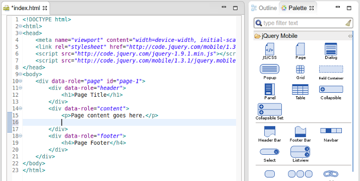
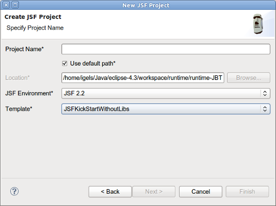

= JST / JSF / HTML Editor What's New in 4.1.0.CR1
:page-layout: whatsnew
:page-component_id: jst
:page-component_version: 4.1.0.CR1
:page-product_id: jbt_core 
:page-product_version: 4.1.0.CR1

== jQuery Mobile
=== jQuery Mobile Palette

HTML text formatting for code snippets inserted via the Palette view was improved. The Palette view now creates a formatted HTML code based on Eclipse preferences for text editors.

related_jira::JBIDE-14735[]

== JSF 2.2
=== New JSF 2.2 Project Wizard

New JSF Project wizard now supports JSF 2.2:

related_jira::JBIDE-14865[]