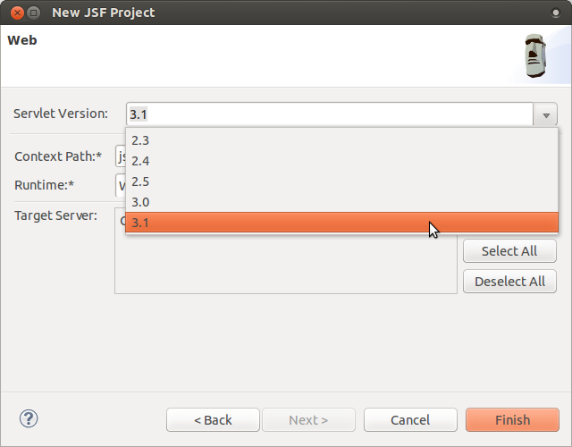

= JST/JSF/HTML Tools What's New in 4.2.0.Alpha2
:page-layout: whatsnew
:page-component_id: jst
:page-component_version: 4.2.0.Alpha2
:page-product_id: jbt_core 
:page-product_version: 4.2.0.Alpha2
:experimental true

== HTML 5

=== jQuery Mobile

The palette view now supports jQuery Mobile 1.4. The palette detects the jQuery Mobile JS file version used in the HTML file and switches to the corresponding version: 1.3 or 14. It also can be switched manually.
jQuery Mobile Palette v1.4 has its own set of wizards.

related_jira::JBIDE-16271[]

Content assist for data-* attributes supports JQM 1.4 too...

related_jira::JBIDE-16294[]

... and for style classes (even if they defined in remote files):

image::images/4.2.0.Alpha2/jqmCA.png[]

related_jira::JBIDE-16294[]

New Form Button wizard is now available in jQuery Mobile (1.3 and 1.4) Palette:

image::images/4.2.0.Alpha2/formButton.png[]

related_jira::JBIDE-15659[]

There is a new option to generate a menu in New Panel wizard:

related_jira::JBIDE-16322[]

Drag and Drop from Palette was improved. It now insert tags only in text nodes and don't break any existing tags/attributes:

See http://www.screenr.com/embed/207N[screencast].

related_jira::JBIDE-16345[]

== AngularJS

=== Attribute Content Assist

Content assist for AngularJS ng-* attributes is available in JBoss HTML Editor:

related_jira::JBIDE-15378[]

=== Filename Content Assist

A new content assist works for full path and for file names in the following HTML tags:

* 
and the file does not exist JBoss Tools HTML Editor offers creating the file.

image::images/4.2.0.Alpha2/newFile.png[]

related_jira::JBIDE-15348[]

=== HTML5 Properties view

Properties view for HTML5 files was improved. It now provides an advanced look and feel for basic HTML5, jQuery Mobile and AngularJS components and attributes.

image::images/4.2.0.Alpha2/jqm.png[]

related_jira::JBIDE-15713[]

== JSF

=== Servlet version 3.1

New JSF project wizard now supports servlets 3.1.

related_jira::JBIDE-15604[]