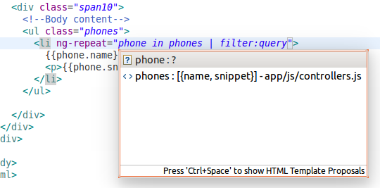
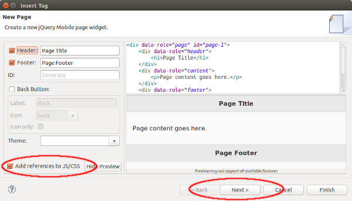
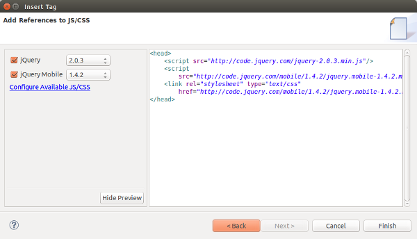
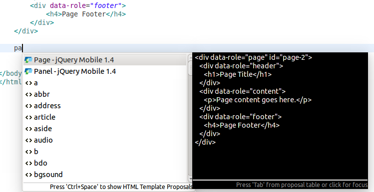
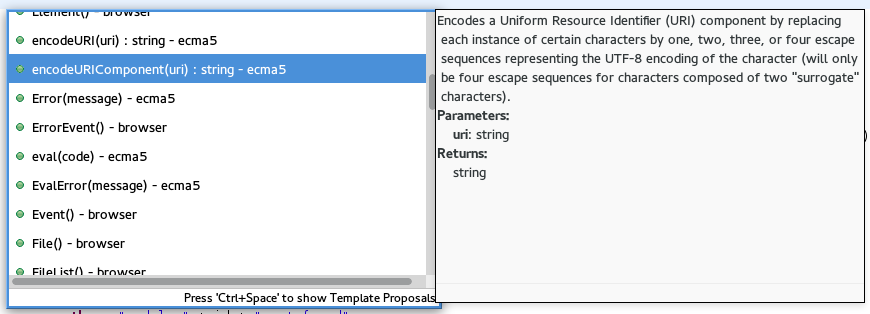
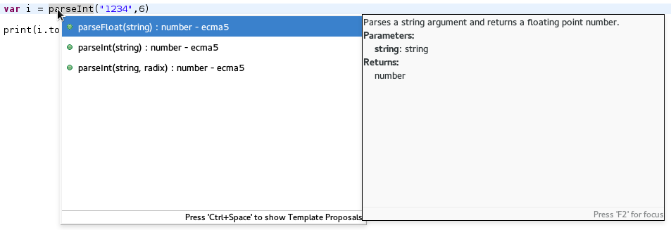

= JST/JSF/HTML Tools What's New in 4.2.0.Beta2
:page-layout: whatsnew
:page-component_id: jst
:page-component_version: 4.2.0.Beta2
:page-product_id: jbt_core 
:page-product_version: 4.2.0.Beta2
:experimental true

== AngularJS Eclipse Plugin integration

If you have AngularJS Eclipse Plugin installed in your Eclipse then JBoss Tools will enable AngularJS support in JavaScript projects automatically. For such projects, JBoss Tools HTML editor now provides AngularJS specific code assist, navigation, etc.

AngularJS Eclipse Plugin is available for installation in the Software/Update tab of JBoss Central (you need to enable Early Access features first).

related_jira::JBIDE-17217[]

== Multiple versions of jQuery in jQuery Mobile Palette

Since JBoss Tools 4.2.0.Beta2, jQuery Mobile Palette supports multiple versions of jQuery and jQuery Mobile JS/CSS files in the New Widget dialog.

If there are no jQuery files references in the HTML page when inserting a jQuery Mobile widget from the Palette, then the corresponding JS and CSS links are added to the header element of the page automatically by default (can be disabled).

related_jira::JBIDE-17032[]

== Drag and Drop improvements

Drag and Drop from jQuery Mobile Palette was improved and inserts widgets in proper places on the page, not just wherever the cursor/mouse happens to be. For example if you trying to drop a new page into another page then the page will be inserted right after or before the existing page element. If there is no proper place for the widget then a warning message will be shown:

video::NXtWkSdaCoI[youtube]

related_jira::JBIDE-16321[]

== Palette entries via content assist

There is now one more way to insert an HTML5 widget from the Palette view. All palette entries are available via content assist (Ctrl+Space) as templates.

video::LY1bcIyIZc8[youtube]

related_jira::JBIDE-16687[]

== JavaScript Editing improvments

Content Assistant in JavaScript is extended with the proposals on Objects, Properties and Functions of ECMA5 JavaScript Specification

related_jira::JBIDE-17159[]
