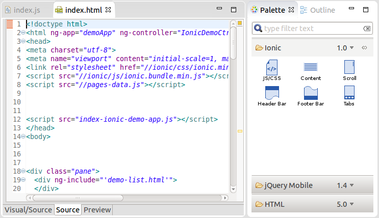
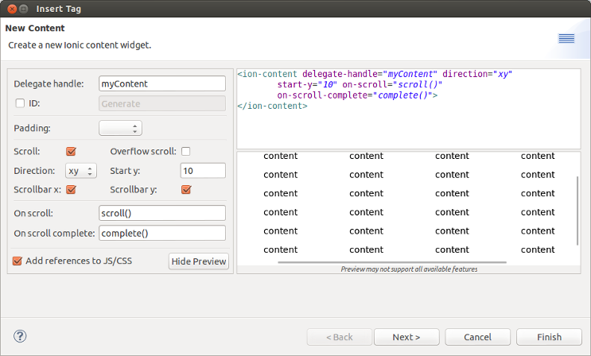
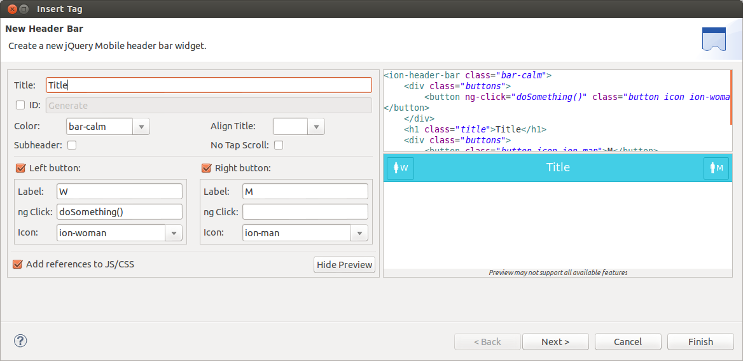
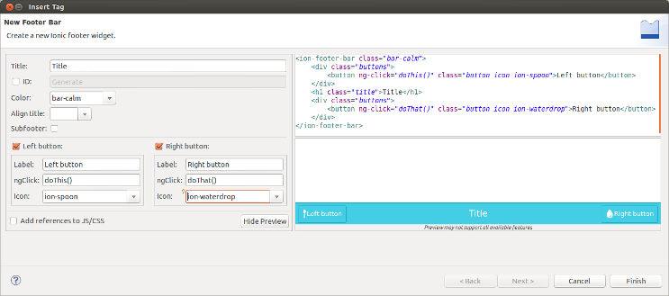
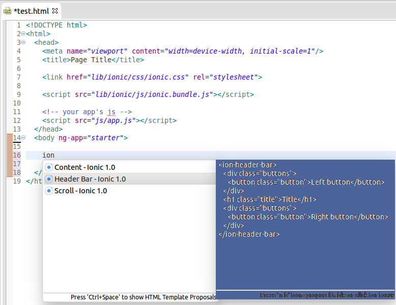

= JST/JSF/HTML Tools What's New in 4.2.0.Beta3
:page-layout: whatsnew
:page-component_id: jst
:page-component_version: 4.2.0.Beta3
:page-product_id: jbt_core 
:page-product_version: 4.2.0.Beta3
:experimental true

== JavaScript Editing improvments

Target Platform is updated with the Tern.java v.0.4.0.201407030911 in order to bring the latest improvments and fixes of JavaScript Content Assistant into JBoss Tools:

* Embedded Node.js distribution provided for Windows x86/x86_64, Mac OS X, Lunix x86/x86_64
* Embedded Node.js is used by default, so tern works right out-of-the-box
* ECMA5 and Browser Tern Modules are turned on by default for JavaScript projects
* Cordova Tern Module is turned on by default for HMT projects

related_jira::JBIDE-17673[]

== Ionic

In this release we introduce an initial support for http://www.ionicframework.com[Ionic] widgets in the HTML5 palette view.

=== Content

related_jira::JBIDE-17851[]

=== Header bar

related_jira::JBIDE-17728[]

=== Footer bar

related_jira::JBIDE-17874[]

=== Tabs

image::images/4.2.0.Beta3/tabs.png[]

related_jira::JBIDE-17912[]

=== Scroll

image::images/4.2.0.Beta3/scroll.png[]

related_jira::JBIDE-17850[]

=== Content assist

All these widgets are also available as templates in code assist.

related_jira::JBIDE-17852[]

We continue to work on this palette and more widgets are coming with the next release.