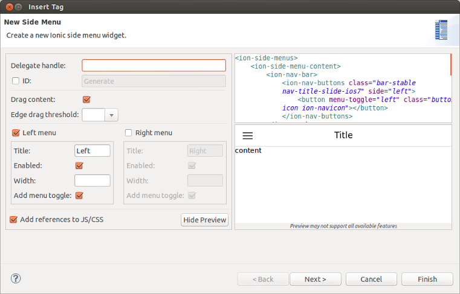
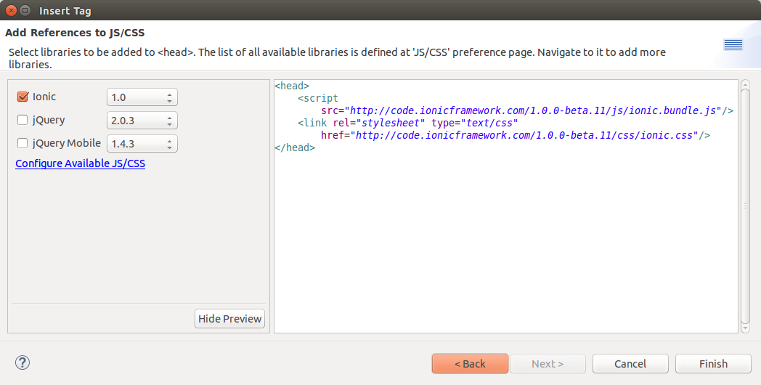

= JST/JSF/HTML Tools What's New in 4.2.0.CR1
:page-layout: whatsnew
:page-component_id: jst
:page-component_version: 4.2.0.CR1
:page-product_id: jbt_core 
:page-product_version: 4.2.0.CR1
:experimental true

== Ionic

=== Palette

We continue to add new widget wizards to http://www.ionicframework.com[Ionic] Palette for HTML5 files.

image::images/4.2.0.CR1/palette.png[]

The following widgets are now available in this release:

- list
- side menu
- refresher
- button
- text input
- radio
- toggle
- checkbox
- slidebox
- tab
- navigation

When a ionic widget is added to an HTML file the links to ionic JS/CSS CDN resources may also be created.
These JS/CSS links can be edited in JBoss Tools Preferences.

related_jira::JBIDE-17728,JBIDE-18077[]

=== Content assist

Content assist (Ctrl+Space) for <ion-*> tags and their attributes is now supported by JBoss Tools HTML editor.

image::images/4.2.0.CR1/ionic-ca.png[]

related_jira::JBIDE-17981[]

== AngularJS support improvements

Target Platform is updated with the Tern.java v.0.6.0.201409041810 and JBoss Central Early Access is updated with AngularJS IDE v.0.5.0.201408281218 in order to bring the latest improvements and fixes of JavaScript and AngularJS support into JBoss Tools.
AngularJS content assist and code highlighting now work in JBoss Tools HTML Editor.

image::images/4.2.0.CR1/angular.png[]

related_jira::JBIDE-18273,JBIDE-17995,JBIDE-17979[]