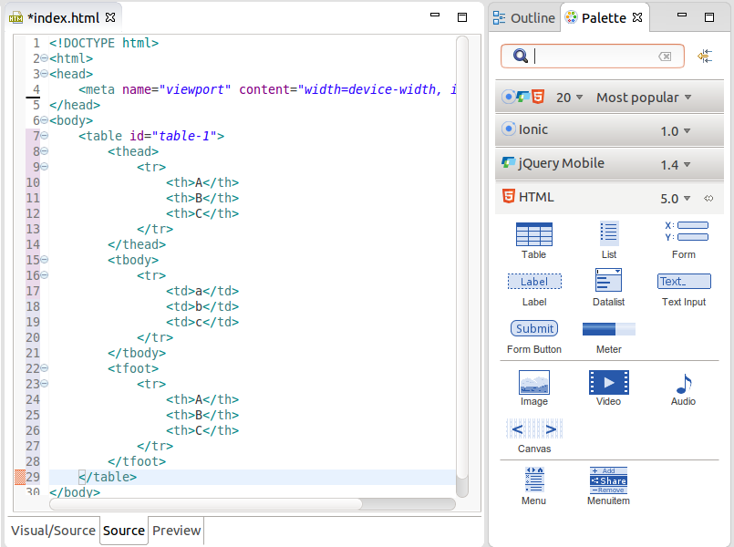
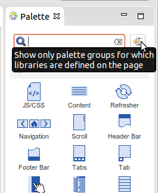
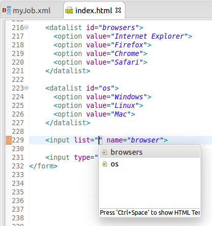

= JST/JSF/HTML Tools What's New in 4.3.0.Alpha1
:page-layout: whatsnew
:page-component_id: jst
:page-component_version: 4.3.0.Alpha1
:page-product_id: jbt_core 
:page-product_version: 4.3.0.Alpha1
:experimental true

== Palette

=== New HTML 5 Widgets

New HTML 5.0 widgets were added to the Palette:

- Canvas
- Datalist
- Table
- Text Input
- Button
- Menuitem
- Menu
- Meter
- List

related_jira::JBIDE-17058[]

=== Last Used/Most Popular Widgets

A new group of the last used/most popular HTML widgets is now available in Palette view:

video::cmgU4eKzJDQ[youtube]

related_jira::JBIDE-18669[]

=== Filter for Libraries Defined on Page

There is a new filter to show only palette groups for which libraries are defined on the page

related_jira::JBIDE-18188[]

== Content Assist and Navigation for Datalist

Content Assist for <input list="|"> now refers to the available <datalist> elements. Ctrl+Click on the list ID will navigate to the corresponding <datalist id="..."> 

related_jira::JBIDE-18960,JBIDE-18962[]

ifndef::finalnn[]
== Tern.java & AngularJS Eclipse 0.8.0

Tern.java and AngularJS Eclipse (available via JBoss Central - Early Access) has been upgraded to the latest 0.8.0 version.

Check out its new and noteworthy:

- https://github.com/angelozerr/tern.java/wiki/New-and-Noteworthy-0.8.0[Tern.java 0.8.0 New and Noteworthy]
- https://github.com/angelozerr/angularjs-eclipse/wiki/New-and-Noteworthy-0.8.0[AngularJS Eclipse Plugin 0.8.0 New and Noteworthy]
endif::finalnn[]