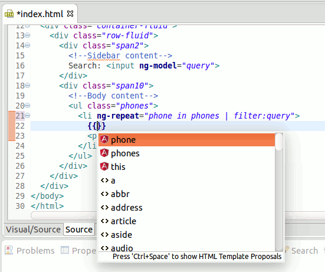
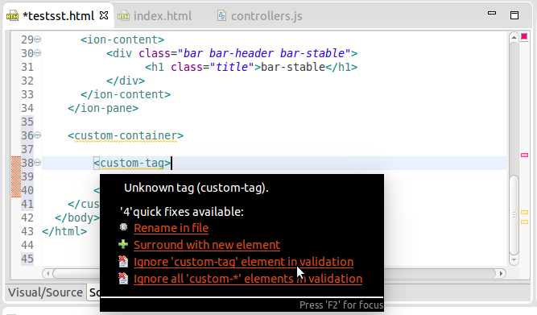
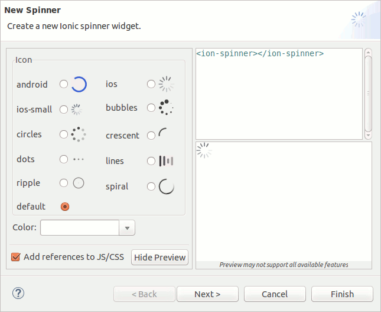

= JST/JSF/HTML Tools What's New in 4.3.0.Alpha2
:page-layout: whatsnew
:page-component_id: jst
:page-component_version: 4.3.0.Alpha2
:page-product_id: jbt_core 
:page-product_version: 4.3.0.Alpha2
:experimental true

== Content assist for Angular expressions

We are happy to introduce our new dynamic content assist for Angular expressions +{{expression}}+ 
which is based on information collected from AngularJS runtime model via AngularJS API.
When the content assist for any +{{expression}}+ is being invoked within any HTML file 
with some attached controller and there is no any critical errors in the file and required JS files 
then we run an internal web browser behind the scenes to retrieve all available JS objects.

Note: These features are available via JBoss Central as a part of *AngularJS for Web Tools*

related_jira::JBIDE-15714[]

== Custom HTML Tag Validation

HTML validation in Eclipse Web Tools had an annoying issue with custom HTML5 tags. It warns about any HTML tag name that is not mentioned in the HTML specification.
We contributed a patch to Eclipse Mars which allows to disable those warnings for any particular tag name (or a tag name mask, e.g. <ion-*>).

related_jira::JBIDE-18387[]

== New Ionic Spinner Widget

New spinner widget is available in Ionic Palette:

related_jira::JBIDE-19514[]

ifndef::finalnn[]
== Tern.java & AngularJS Eclipse 0.9.0

Tern.java and AngularJS Eclipse has been upgraded to the 0.9.0.201504141710 snapshot.

Check out its new and noteworthy:

- https://github.com/angelozerr/tern.java/wiki/New-and-Noteworthy-0.9.0[Tern.java 0.9.0 New and Noteworthy]
- https://github.com/angelozerr/angularjs-eclipse/wiki/New-and-Noteworthy-0.9.0[AngularJS Eclipse Plugin 0.9.0 New and Noteworthy]

Note: These features are available via JBoss Central - Early Access as a part of *AngularJS for Web Tools*

related_jira::JBIDE-19592[]
endif::finalnn[]