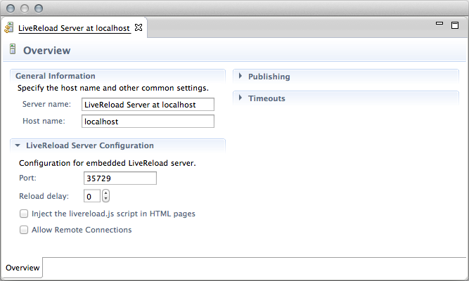

= LiveReload What's New in 1.2.0.Alpha2
:page-layout: whatsnew
:page-component_id: livereload
:page-component_version: 1.2.0.Alpha2
:page-product_id: jbt_core
:page-product_version: 4.2.0.Alpha2

== General

=== Optional Reload Delay

The LiveReload Server Configuration Editor now provides a "Reload Delay" option to set the number of seconds to wait before "reload" messages are sent to browsers.

This delay allows the application server to take the changes fully into account before the browsers send their request. According to some reports, in some cases the server returned an error because of resources or libraries still being reloaded when the requests arrived. This fix addresses this problem.

By default, the reload delay is set to '0'. Once the configuration is saved, the LiveRoad server does not need to be restarted to use the new value.

The delay appears as a job running in the Progress View and it can be canceled if the wait period was set too high (in which case the "reload" messages are immediately sent to the browsers).

related_jira::JBIDE-14999[]
