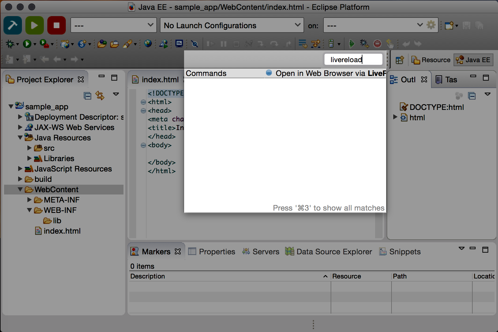

= LiveReload What's New in 1.3.0.CR1
:page-layout: whatsnew
:page-component_id: livereload
:page-component_version: 1.3.0.CR1
:page-product_id: jbt_core
:page-product_version: 4.3.0.CR1

== General

=== Quick Access to Launch LiveReload

Users can now launch LiveReload from the 'Quick Access' menu, or using the
  Ctrl+3 (or Cmd+3) keyboard shortcut.

This displays the dialog to create and start a LiveReload server and then it opens the current element (a selected file in the
  Project Explorer, a selected module in the Servers view or the content of the active editor)
  in the browser, without using the 'Open With>Web Browser via LiveReload Server' contextual menu.

related_jira::JBIDE-20059[]
